# Analyser la sécurité du trafic réseau avec Wireshark

Il vous est demandé de procéder à l'analyse des protocoles utilisés sur le réseau et de détecter d'éventuelles faiblesses.

A partir du Lab installé, ajouter les services nécessaires et répondre aux questions suivantes.

---

### Rappels

* Quelle est votre adresse IP ? Quelle est sa classe (IPv4) ?  `192.168.0.11  classe C`

* Quel est votre masque de sous-réseau ? `255.255.255.0`     

* Quelle est l'adresse de votre passerelle ? `192.168.0.1`
---

### Questions

 ## 0. Quels sont les `flags TCP` ?

| **Nom du Flag** | **Acronyme**              | **Rôle / Description**                                                                                              |
| --------------- | ------------------------- | ------------------------------------------------------------------------------------------------------------------- |
| **URG**         | Urgent                    | Indique que le champ **Urgent Pointer** est valide et que certaines données doivent être traitées en priorité.      |
| **ACK**         | Acknowledgment            | Indique que le champ **Acknowledgment Number** est valide. Sert à confirmer la réception de paquets.                |
| **PSH**         | Push                      | Demande à l’hôte récepteur de traiter immédiatement les données (sans attendre un buffer plein).                    |
| **RST**         | Reset                     | Réinitialise brutalement la connexion TCP. Sert à refuser ou interrompre une session.                               |
| **SYN**         | Synchronize               | Sert à synchroniser les numéros de séquence lors de l’établissement d’une connexion (le fameux "SYN" du handshake). |
| **FIN**         | Finish                    | Indique la fin de la transmission (fermeture propre de la connexion).                                               |
| **ECE**         | ECN Echo                  | Utilisé pour la notification de congestion explicite (ECN).                                                         |
| **CWR**         | Congestion Window Reduced | Indique que l’émetteur a réduit sa fenêtre de congestion à cause d’une notification ECN.                            |
| **NS**          | Nonce Sum                 | Utilisé pour vérifier l’intégrité de la gestion ECN (rarement utilisé).                                             |

## 1. Capturer le processus `DORA` du protocole DHCP

- 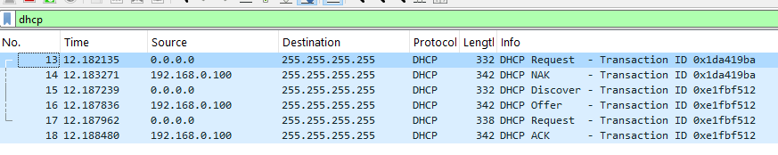

## 2. Qu’est ce que le `DHCP Starvation` / `snooping` ? `Rogue DHCP` ?

- DHCP Starvation : attaque où un attaquant envoie massivement des DHCPDISCOVER (souvent avec des adresses MAC fictives) pour exhausser la table de baux du serveur DHCP et épuiser toutes les adresses disponibles → empêche les clients légitimes d’obtenir une adresse.

- DHCP Snooping (fonction réseau) : fonctionnalité de switches qui filtre les messages DHCP pour ne permettre les réponses DHCP (Offers/ACKs) que depuis des ports de confiance (trusted ports) — bloque les réponses depuis ports non-trustés pour empêcher les serveurs DHCP non autorisés. Aussi construit une table DHCP binding (IP↔MAC↔port) utilisée par d’autres protections

- Rogue DHCP : serveur DHCP malveillant ou mal configuré dans le réseau qui fournit de mauvaises informations (gateway DNS malicieux…) → redirection, interception, MITM.

## 3. Que ce passe-t-il lors de l'execution de la commande `ipconfig /release` (windows) ? D’un point de vue sécurité quel peut etre l'enjeu ?

- le client Windows envoie (si possible) un DHCPRELEASE au serveur DHCP pour libérer l’adresse et supprime l’adresse localement.

***Enjeu de sécurité***

- Un administrateur malveillant côté réseau pourrait forcer des clients à relâcher leurs adresses (ex. via commandes à distance, scripts, ou via attaque sur client), les forcer à renouveler et potentiellement attraper une nouvelle adresse avec post-configuration malveillante (si un rogue DHCP existe).

- ipconfig /release n’est pas en soi dangereux, mais dans un réseau compromis il peut être exploité pour provoquer un déni de service local, ou pousser des clients vers un serveur DHCP rogue.

## 4. Quelle fonctionnalité propose CISCO pour se prémunir des `attaques DHCP` ?

- Cisco : implémente DHCP Snooping, ainsi que IP Source Guard et Dynamic ARP Inspection (DAI) qui tirent parti de la table DHCP-snooping pour empêcher usurpation d’IP/MAC et attaques ARP.

## 5. Capturer une `requête DNS` et sa réponse

***Requête DNS***

- 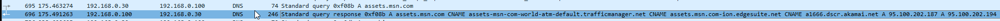
 
***Reponse DNS***

- 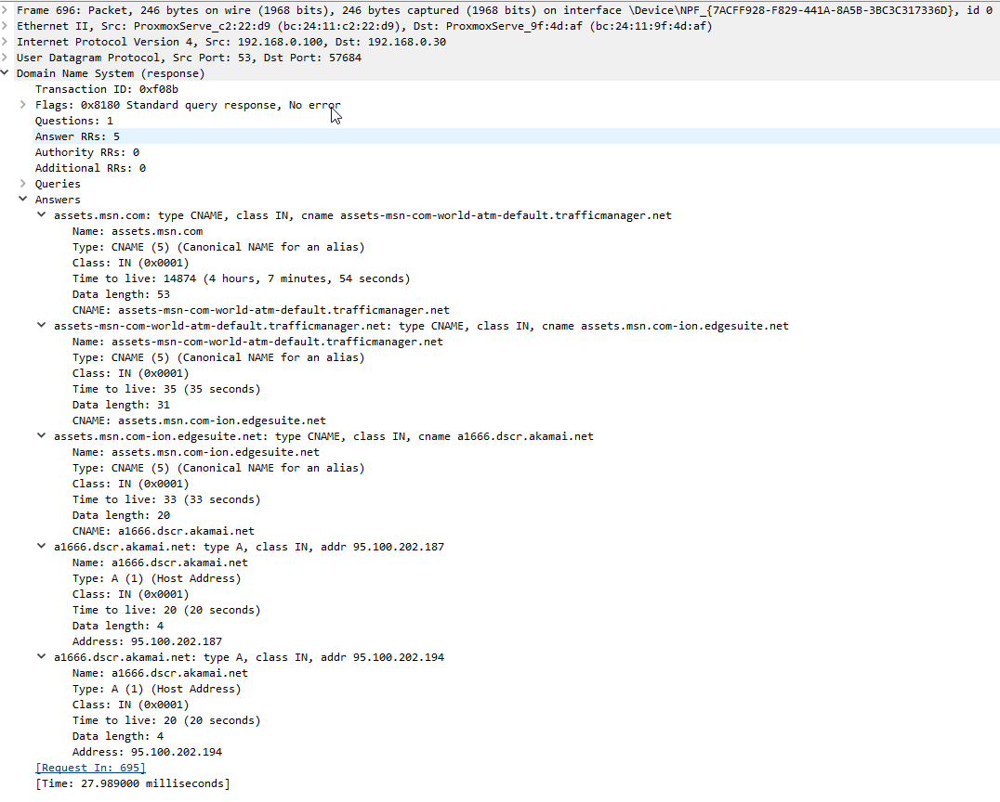

## 6. Qu’est-ce que le `DNS Spoofing` ? Comment s’en protéger ?

- L’usurpation de DNS est une cyberattaque par laquelle un pirate modifie les enregistrements DNS afin de rediriger le trafic d’un site web légitime vers un site frauduleux. Cela peut conduire au vol de données, à l’hameçonnage ou à l’installation de logiciels malveillants. Les attaquants exploitent les faiblesses des protocoles DNS ou utilisent l’empoisonnement du cache pour tromper les utilisateurs.

***Protections***

- DNSSEC (signature des zones) — vérifie intégrité/authenticité des réponses DNS (signatures RRSIG).

- Utiliser DNS over TLS (DoT) ou DNS over HTTPS (DoH) entre client et résolveur pour chiffrer la requête au transit.

- Utiliser résolveurs fiables, durcir et patcher serveurs DNS, monitoring (détecter réponses inattendues), limiter recursion pour serveurs publics, sécuriser accès aux résolveurs.

## 7. Qu’est-ce que `DNSSec` ? `DNS over TLS` ou `DNS over HTTPS` ?

- DNSSEC : ensemble d’extensions du DNS qui ajoutent des signatures numériques (RRsig) aux enregistrements DNS et une chaîne de confiance (via clés publiques) pour vérifier que la réponse n’a pas été altérée et provient bien de la zone signée. DNSSEC n’encrypte pas la requête, il assure authenticité et intégrité.

- DNS over TLS (DoT) : DNS chiffré via TLS (port par défaut 853). Cible la confidentialité (protéger le contenu des requêtes DNS entre client et résolveur).

- DNS over HTTPS (DoH) : DNS chiffré transporté sur HTTPS (généralement port 443). Avantage : passe facilement les proxys/firewalls, mais soulève des débat sur centralisation des résolveurs.

## 8. Dans quels cas trouve-t-on du DNS sur TCP ?
Le DNS utilise généralement le protocole UDP car les requêtes et les réponses sont petites et rapides, et UDP ne nécessite pas d'établissement de connexion, ce qui est efficace pour le trafic léger. Cependant, on trouve du DNS sur TCP dans certains cas spécifiques :

- Quand la taille d'une réponse DNS dépasse la limite d'UDP (historique 512 octets, aujourd’hui souvent un peu plus grâce à EDNS), la réponse est tronquée en UDP et le client doit refaire la requête en TCP pour récupérer la réponse complète.

- Pour les transferts de zone DNS entre serveurs DNS, qui impliquent l’envoi de gros volumes de données, TCP est systématiquement utilisé car il garantit la fiabilité et l'intégrité des données.

- Si une requête DNS échoue en UDP (pas de réponse reçue), le client peut tenter une retransmission via TCP.

## 9. Capturer un flux `HTTP`

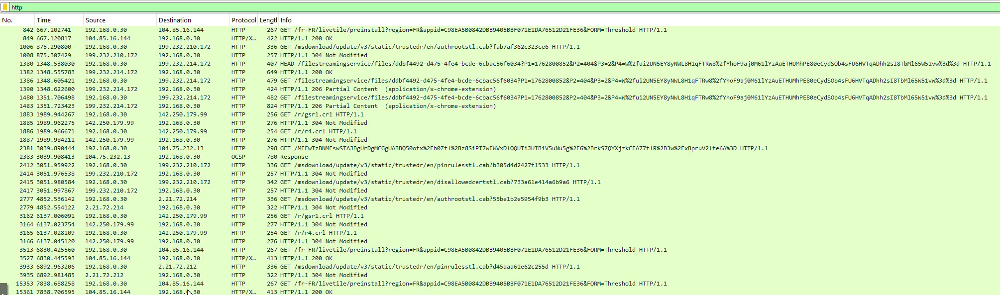

## 10. Qu’est-ce que le `HTTP Smuggling` ? Donner un exemple de `CVE`

- L’objectif de l’attaque HTTP request smuggling est de désynchroniser la communication entre le serveur frontal (proxy ou load balancer) et le serveur backend. Cette désynchronisation survient lorsque ces deux serveurs interprètent différemment la taille du corps d’une requête HTTP.

Le problème vient principalement de la coexistence des en-têtes Content-Length et Transfer-Encoding. Normalement, un serveur utilise Content-Length pour définir la taille du contenu d’une requête. Cependant, si l’un des serveurs prend en charge Transfer-Encoding, mais pas l’autre, une ambiguïté peut apparaître.

En exploitant cette confusion, un attaquant peut :

- Injecter des requêtes malveillantes dans le flux de communication.
- Forcer d’autres utilisateurs à exécuter des requêtes à leur insu.
- Intercepter des réponses HTTP destinées à d’autres utilisateurs.
- Polluer la file de réponses d’un serveur, provoquant des dysfonctionnements proches d’une attaque DoS, tout en permettant le vol d’informations sensibles.

## 11. Comment mettre en place la confidentialité et l'authenticité pour HTTP ?

- Utiliser HTTPS (TLS) : chiffrement + authentification (certificat serveur) → confidentialité + intégrité + authentification du serveur.

Bonnes pratiques TLS :

Forcer TLS 1.2+ (idéal TLS 1.3), chiffres modernes, désactiver SSL/TLS anciens.

HSTS (HTTP Strict Transport Security) pour forcer clients à utiliser HTTPS.

Certificats valides délivrés par AC de confiance, renouvellement/rotation, OCSP stapling.

## 12. Qu’est-ce qu’une `PKI` ?

- Une PKI, ou Infrastructure à Clé Publique (Public Key Infrastructure en anglais), est un ensemble de technologies, de politiques et de procédures destinées à gérer de manière sécurisée les clés cryptographiques et les certificats numériques. La PKI permet d'authentifier les identités des utilisateurs ou des appareils, de chiffrer les communications pour garantir leur confidentialité, et d'assurer l'intégrité et la non-répudiation des échanges numériques.

## 13. Capturer un `mot de passe` HTTP via le projet VulnerableLightApp.

- Changement de MDP :

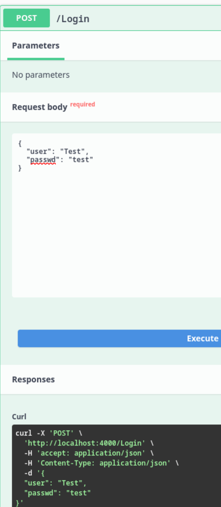

- Capture :

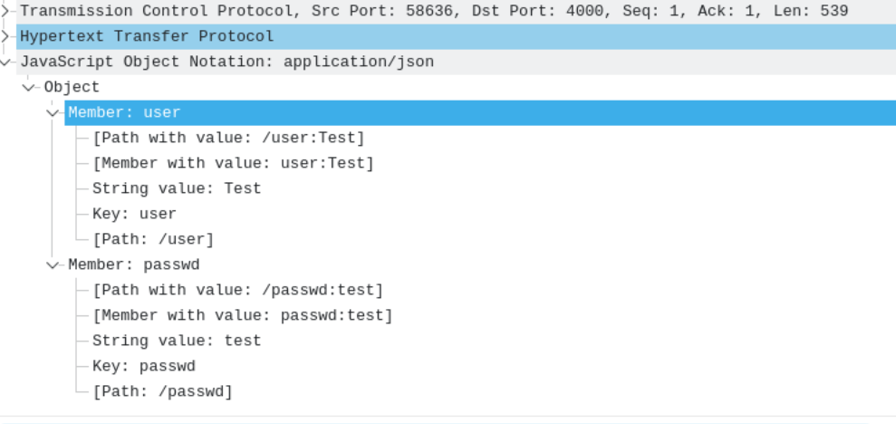

## 14. Comment mettre en place la `confidentialité` pour ce service ?

- Activer TLS (HTTPS) : obtenir un certificat valide et configurer le serveur pour servir l’app via HTTPS uniquement.

## 15. Capturer un `handshake TLS`

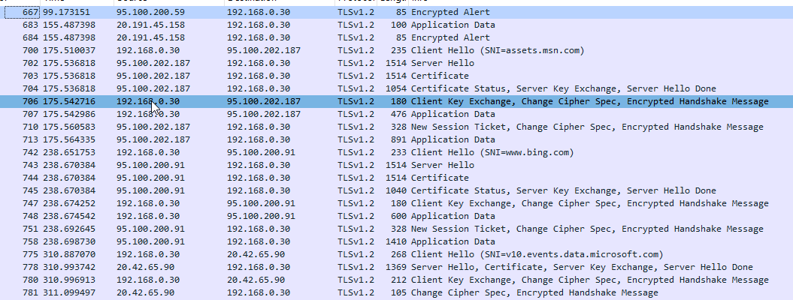

## 16. Qu’est-ce qu’une autorité de certification (`AC`) racine ? Qu'est qu'une `AC intermediaire` ?

- Une autorité de certification (AC) racine est l’autorité la plus élevée et la plus fiable dans la hiérarchie des certificats numériques. Elle est auto-signée. Ce certificat racine est préinstallé dans les navigateurs web et systèmes d’exploitation, ce qui permet de leur faire automatiquement confiance. Les AC racines délivrent des certificats intermédiaires ou directement des certificats utilisateur, mais pour des raisons de sécurité, elles émettent rarement des certificats finaux directement.

- Une autorité de certification intermédiaire est une AC située entre l’AC racine et les certificats finaux (utilisateurs ou serveurs). Elle est signée par l’AC racine ou par une autre AC intermédiaire supérieure, et elle a pour rôle de délégué l’émission des certificats. Cela permet de créer une chaîne de confiance : le certificat final est émis par une AC intermédiaire, qui elle-même est signée par l’AC racine. Cette architecture ajoute une couche de sécurité, car la clé privée de l’AC racine est protégée hors ligne, et en cas de compromission d’une AC intermédiaire, les conséquences sont contenues.

## 17. Connectez-vous sur `taisen.fr` et affichez la `chaine de confiance` du certificat

- 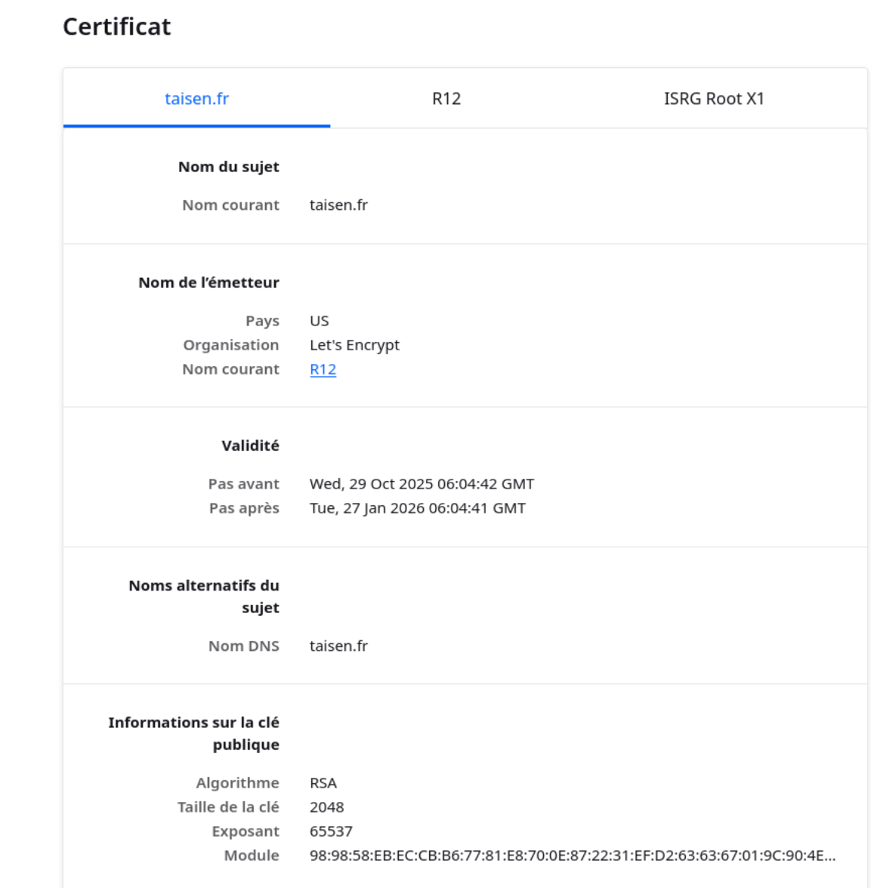

## 18. Capturer une authentification `Kerberos` (mettre en place le service si nécessaire), identifier l'`AS_REQ`, `AS_REP` et les messages suiv

- 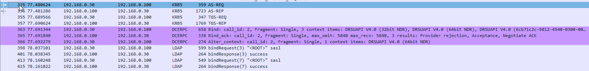

## 19. Capturer une `authentification RDP` (mettre en place le service si nécessaire), quel est le protocole d'authentification capturé ?

- 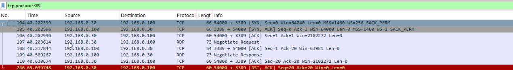

## 20. Quelles sont les attaques connues sur `NetLM` ?

- Faible résistance aux bruteforce (algorithme old, salage/complexité insuffisants).

- Pass-the-hash (PtH) : réutilisation du hash NTLM/LM pour s'authentifier sans connaître le mot de passe.

- Relay attacks / NTLM relay : relayer des authentifications NTLM vers d’autres services.

- Brute-force / rainbow tables pour LM (LM découpe le mot de passe en deux moitiés et le rends très vulnérable).

## 21. Capturer une `authentification WinRM` (Vous pouvez utiliser EvilWinRM si nécessaire côté client.), quel est le protocole d'authentification capturé ?

- 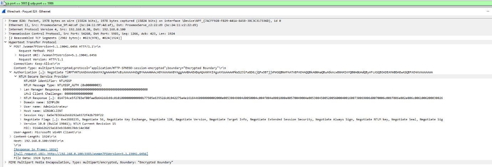

## 22. Capturer une `authentification SSH` ou SFTP (mettre en place le service si nécessaire)

- 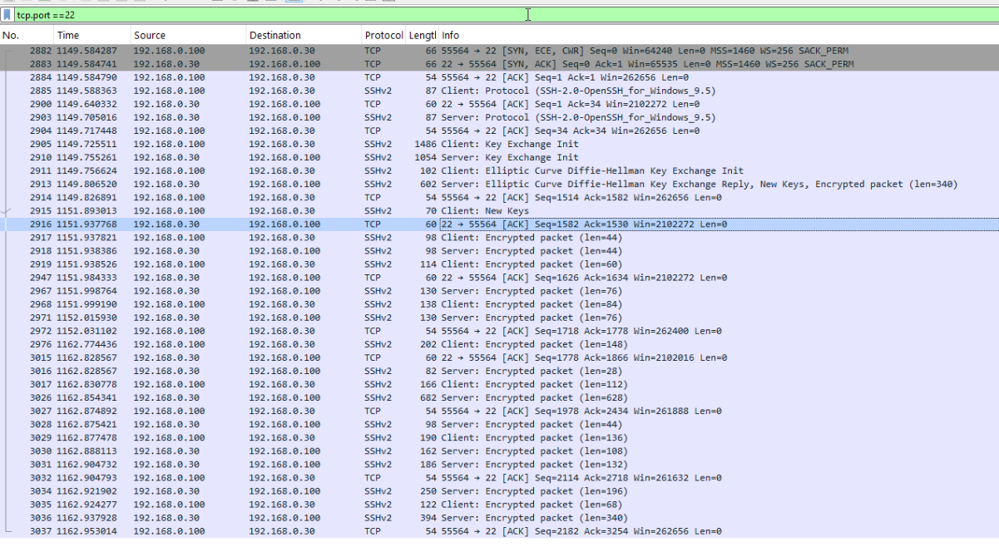

## 23. Intercepter un `fichier au travers du protocole SMB`

- 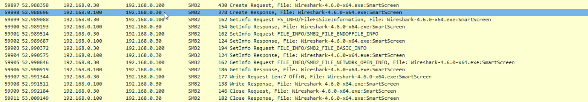

- 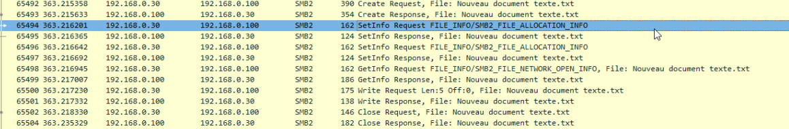

## 24. Comment proteger l'`authenticité` et la `confidentialité` d'un partage SMB ?

- Activer SMB Signing (authenticité / intégrité) : empêche modification/relay des paquets.

- Activer SMB Encryption (SMB3+) : chiffrement au niveau du protocole pour protéger la confidentialité des données en transit.

- Utiliser Kerberos pour l’authentification (plutôt que NTLM).

- Appliquer ACLs strictes, segmenter via VLANs, firewall, limiter partages publics, MFA pour l’accès à distance, surveillance et patching.