# ***ANSIBLE***

## **Sommaire**

- [Livrable](#livrable)
- [Installation Globale](#installation-globale)

# Livrable

### - Fichier d'inventaire
- Avant creation de l'user

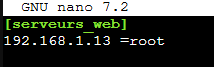

- Apres Creation de l'user devops


### - Playbooks 1-update-os.yml

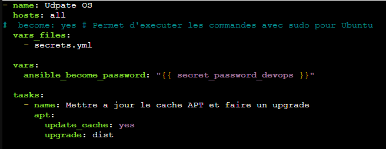

### -  2-create-user.yml

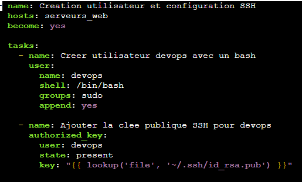

### - 3-deploy-website.yml

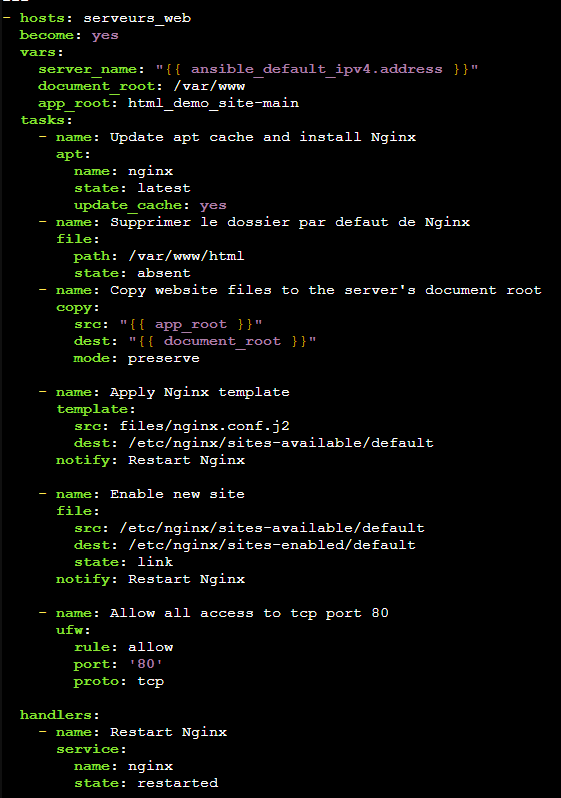

### - Le fichier source de la page web (index.html)

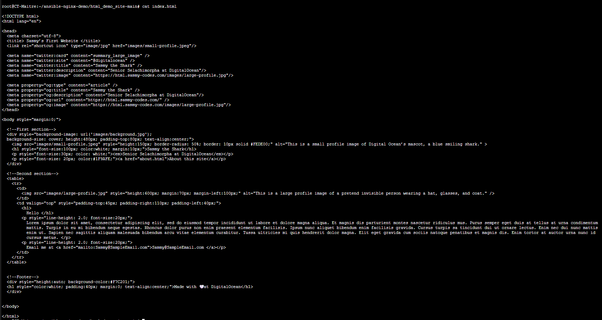


### Utilisation des commandes pour lancer les playbooks.

- Au debut en root avec le permitrootlogin yes

```
ansible-playbook -i inventory.ini 1-update-os.yml -k

```
- Une fois l'user cree avec les droits sudo, le mot de passe, et le vault fonctionnel.Mettre le Permitrootlogin no 

```
ansible-playbook -i inventory.ini 1-update-os.yml --ask-vault-pass

 ```

# Installation Globale

##  Prérequis de l'atelier Ansible 

- Le Controller (Machine A) : Un système sous Ubuntu ou Debian (VM ou CT) où vous allez travailler.
- La Cible (Machine B) : Un serveur sous Ubuntu ou Debian (VM ou CT), accessible par le réseau.
- Accès SSH : Vous devez pouvoir vous connecter en SSH depuis le Controller vers la Cible (avec un utilisateur ayant les droits sudo ou root > `PermitRootLogin Yes` dans `/etc/ssh/sshd_config` de la Cible).

# Étape 1 : Installation et préparation du Controller
L'objectif de cette étape est de mettre en place l'environnement de travail local.

- Mettre à jour les paquets locaux et installer Ansible.
- Créer un répertoire de travail pour garder les fichiers organisés.

### Sur le Controller
```
sudo apt update
sudo apt install ansible -y
```

### Création de l'espace de travail
```
mkdir ~/ansible-lab
cd ~/ansible-lab
```
# Étape 2 : L'inventaire, les prérequis et le "Ping" (La prise de contact)

Ansible a besoin de savoir à quelles machines il doit parler. Au lieu de modifier les fichiers globaux du système, nous allons utiliser les bonnes pratiques en créant un inventaire local. 

De plus, comme nous n'avons pas encore configuré de clés SSH, nous allons utiliser une connexion par mot de passe pour ce premier test.

## Action 1 : Installer l'utilitaire de mot de passe
Pour qu'Ansible puisse injecter automatiquement un mot de passe lors de la connexion SSH (sans que SSH ne le bloque), le paquet sshpass est requis sur le Controller.

### Sur le Controller
```
sudo apt install sshpass -y

```
## Action 2 : Créer l'inventaire

- Créer un fichier nommé `inventory.ini` dans le dossier `ansible-lab`.
- Y ajouter l'adresse IP du serveur cible et spécifier l'utilisateur de connexion.

```
nano /root/ansible-lab/inventory.ini

```
```
[serveurs_web]
IP_DE_VOTRE_SERVEUR_CIBLE ansible_user=votre_utilisteur_ssh
```


*Remarque: Ubuntu bloque l'accès SSH direct pour root, il faudra renseigner un utilisateur autorisé sudoers.*


## Le Test (Ping) :
Pour lancer le test, nous ajoutons l'option -k (minuscule) à la commande. Cela indique à Ansible de vous demander le mot de passe SSH de l'utilisateur cible avant de lancer l'action.

```
ansible -i inventory.ini serveurs_web -m ping -k
```
*(Ansible affichera SSH password:, tapez le mot de passe de votre utilisateur cible).*

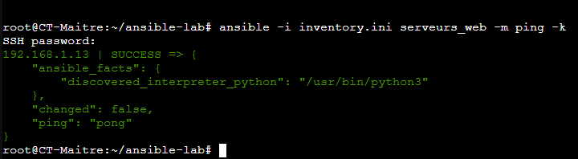


# Étape 3 : Playbook 1 - Mise à jour de l'OS
C'est l'heure du premier Playbook (fichier YAML). L'objectif est de s'assurer que le serveur cible est à jour.

- Créer un fichier 1-update-os.yml et y insérer le code suivant. Observez l'indentation, elle est stricte en YAML !

```
nano 1-update-os.yml

```
```
---
- name: Udpate OS
  hosts: all
#  become: yes # Permet d'executer les commandes avec sudo pour Ubuntu

  tasks:
    - name: Mettre a jour le cache APT et faire un upgrade
      apt:
        update_cache: yes
        upgrade: dist
```
## Executer votre 1er Playbook

```
ansible-playbook -i inventory.ini 1-update-os.yml -k

```
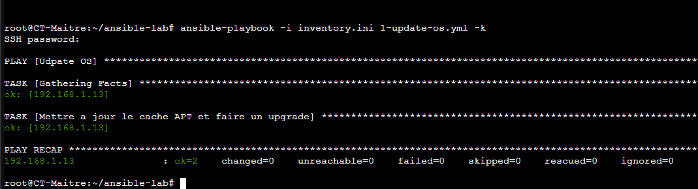

# Étape 4 : Playbook 2 - Sécurité (Nouvel utilisateur et Clé SSH)

- Créer un utilisateur manuellement prend du temps. Ansible peut le faire sur 100 serveurs en une seconde.
- Action préalable : Générer une clé SSH sur son Controller s'il n'en a pas (ssh-keygen -t rsa -b 4096).


⚠️ Si votre OS cible est sous Debian, passer la commande ansible ad-hoc pour installer sudo

```

ansible -i inventory.ini servers -m apt -a "name=sudo state=present update_cache=yes" -k

```
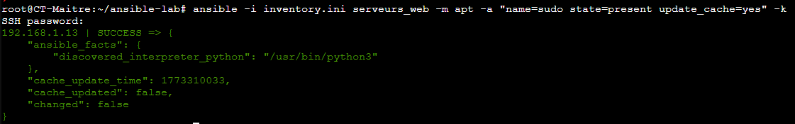

Créer votre second Playbook pour créer le nouveau user "devops" + une clef SSH + le passer sudoers

```
nano 2-create-user.yml

```
```
---
- name: Creation utilisateur et configuration SSH
  hosts: serveurs_web
  become: yes

  tasks:
    - name: Creer utilisateur devops avec un bash
      user:
        name: devops
        shell: /bin/bash
        groups: sudo
        append: yes

    - name: Ajouter la clee publique SSH pour devops
      authorized_key:
        user: devops
        state: present
        key: "{{ lookup('file', '~/.ssh/id_rsa.pub') }}"
```

## Lancer le playbook

```
ansible-playbook -i inventory.ini 2-create-user.yml -k

```
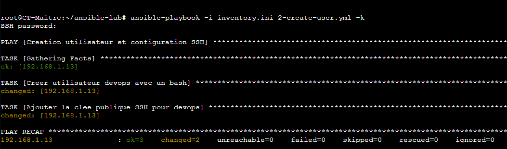

### Test SSH devops

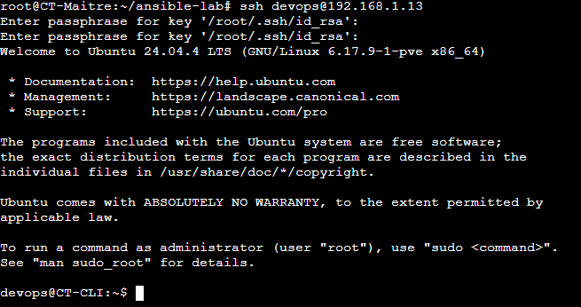

# Etape 5 - Déployer NGINX + site demo

https://www.digitalocean.com/community/tutorials/how-to-deploy-a-static-html-website-with-ansible-on-ubuntu-20-04-nginx

Lien du site: 

`curl -L https://github.com/do-community/html_demo_site/archive/refs/heads/main.zip -o html_demo.zip`

### A quoi doit ressembler le dossier ansible-nginx-demo

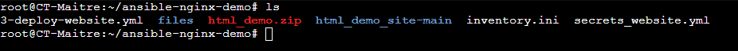

### Playbook 


## Lancer le playbook

```
ansible-playbook -i inventory.ini 3-deploy-website.yml --ask-vault-pass -k

```
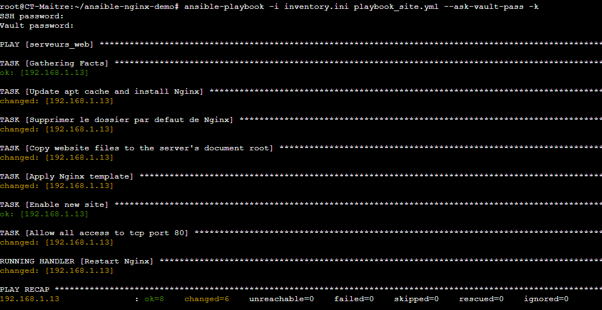

### Resultat site web


- ### Modification du playbook pour utilisation avec vault et nouveau secret pour website

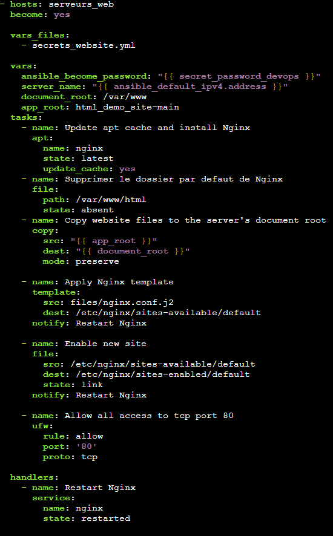

- Lancement du playbook 

```
ansible-playbook -i inventory.ini -u devops 3-deploy-website.yml --ask-vault-pass -K

```
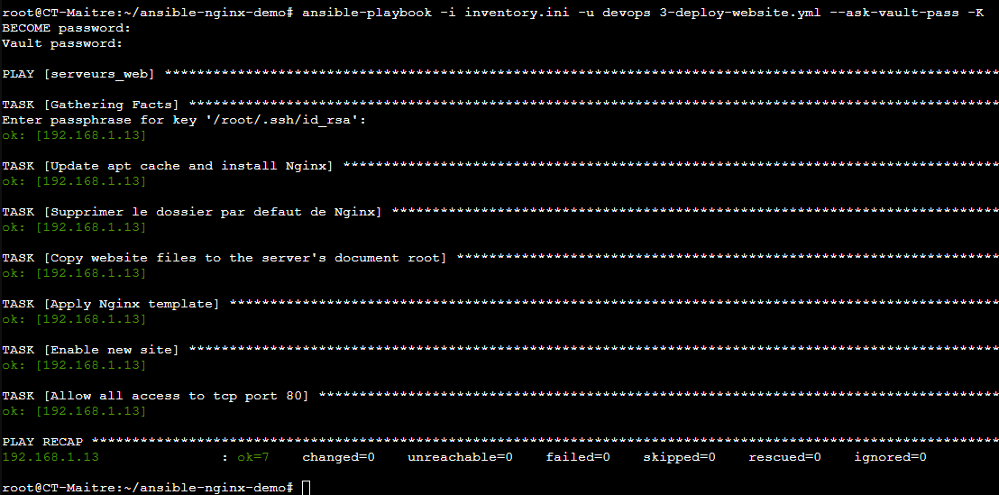


# Etape 6 - Ansible-Vault

- ### Creation de mot de passe avec Vault

```
ansible-vault create secrets.yml

```
- ### Dans vim mettre 

```
secret_password_devops: "monmotdepasse"

```
- ### Pour cryter le fichier faire

```
ansible-vault encrypt secrets.yml

```
- ### Modifier le playbook 1-update-os.yml

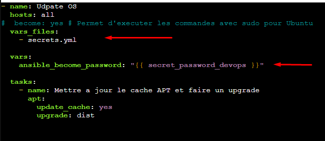

- ### Creer un nouveau playbook 

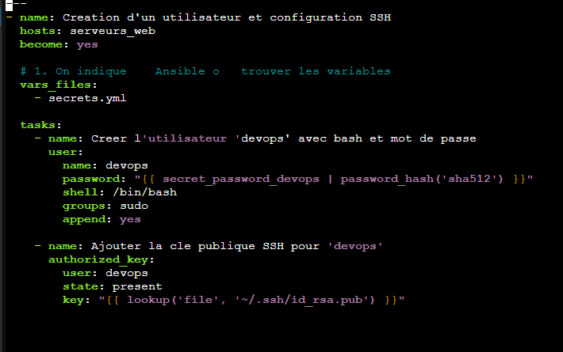

- ### Test du playbook avec la commande

```
ansible-playbook -i inventory.ini 4-secret-devops.yml --ask-vault-pass -k

``` 
 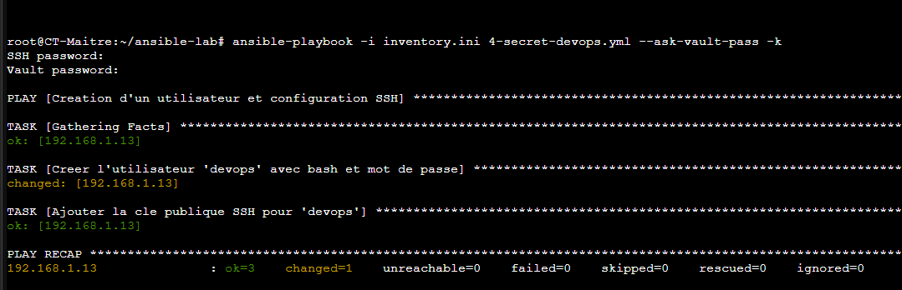

- ### Test de sudo avec le MDP devops + test update avec vault

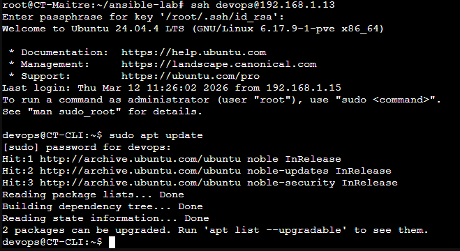

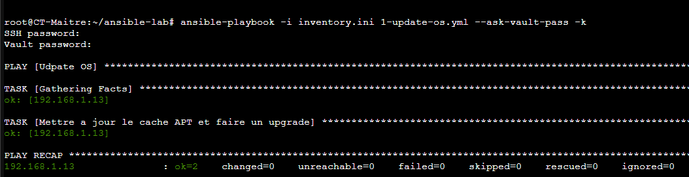


