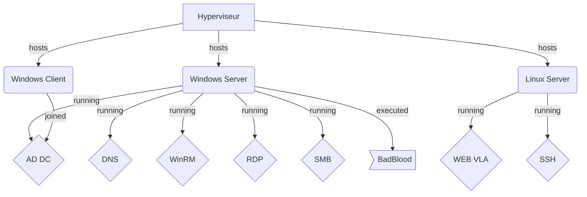

# Creation du Lab

## Sommaire

- [Introduction](#introduction)
- [Schéma réseau](#schéma-réseau)
- [Listes des comptes](#listes-des-comptes)
- [Verification du hash](#verification-du-hash)
- [Mises à jour réussies](#mises-à-jour-réussies)
- [Mises en place de WinRM, Samba, Web-Linux](#mises-en-place-de-winrm-samba-web-linux)
- [Statut des Services](#statut-des-services)
- [Connexions SSH et WinRM](#connexions-ssh-et-winrm)

## **Introduction**
- A Marquer

## **Schéma réseau**

## **Listes des comptes**

| Utilisateurs   | Emplacement |Systeme  |
|-------------|------------|------|
| Admin    |Local        |WinServ    |
| Anthoad  |Local          |WinServ    |

## **Verification du hash**

- Via la cmd Powershell
- $hash = Get-FileHash C:\Chemin\vers\ton\fichier.iso,
- puis en faisant
- $hash.Hash eq 'hash/trouver/sur/le/sie/fabricant/'     ,pour comparer si les 2 hash sont totalement identique.
  

#### ***Sha256 de l'ISO "Debian-12.7.0-amd64-netinst.iso***

 
 #### ***Sha256 de l'ISO "Win10_22H2_French_x64v1.iso"***

#### ***Sha256 de l'ISO "fr-fr_windows_server_2022_x64_dvd_9f7d1adb.iso"***

## **Mises à jour réussies**

- ***Debian12***

- ***WinServ2022***

- ***Win10Client***

## ***Statut des Services***

- **DNS**

- **WEB**

## ***Connexions SSH et WinRM***

- ***SSH***

**Serv-->Client**

**Client-->Serv**

- ***WINRM***

**Client-->Serv**

,

**Serv-->Client**

,

## ***Mises en place de WinRM, Samba, Web-Linux***

- ***WinRM***

- ***Partage SMB***

**Read Only**

, 

 **Write**

, 

- ***Web-Linux***

