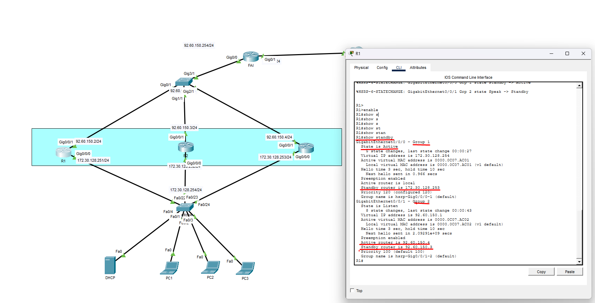

# Objectifs
Le but de cet exercice est d’effectuer une analyse de type « reverse engineering » à partir d’une infrastructure fonctionnelle, sur le thème de HSRP.

## Analyse de l’infrastructure

- Qu’est-ce que HSRP ? Proposer une définition simple.

HSRP est un protocole Cisco qui permet à plusieurs routeurs de fonctionner ensemble dans un groupe,
fournissant une adresse IP virtuelle (l'adresse de passerelle par défaut) qui est partagée entre eux.

- Pourquoi utilise-t-on HSRP et quel problème résout-il ? Expliquer l'intérêt de HSRP dans ce réseau

Cette technologie offre une passerelle par défaut virtuelle stable, assurant une transition transparente
entre les routeurs actif et de secours en cas de besoin. 

L'intérêt de HSRP dans ce réseau est d'avoir de la redondance

## Analyse de la configuration existante

- Identifier les routeurs primaires et les routeurs de secours HSRP, quels sont leurs rôles respectifs ?

R1 est le routeur principal celui qui fonctionne en premier
R2 et R3 sont en ecoute si R1 coupe alors l'un des 2 prendra le relais pour assurer la continuité de services.

- Noter les adresses IP virtuelles (VIP) et physiques (R1, R2, R3) utilisées dans les groupes HSRP, à quoi servent ces différentes adresses ?

R1:172.30.128.254
R2:92.60.150.1

- Identifier les interfaces réseau participant à HSRP sur chaque routeur, leurs priorités, les délais et les autres paramètres HSRP configurés sur les routeurs. Que comprenez-vous ?
Configuration HSRP

- À l'aide des informations que vous avez collectées, proposer un guide de commandes de configuration HSRP. Expliquer brièvement le rôle de chaque commande utilisée. Identifier les éléments clés tels que le numéro de groupe HSRP, les adresses IP virtuelles, les priorités, les délais, ainsi que les commandes permettant d'activer HSRP sur l'interface