# TP1 Cyber Chef

## Partie 1 : Chiffrement de César

Dans « CyberChef » utilisez la recette « ROT13 »

1. Avec une « Box Height » de 13, chiffrer la phrase suivante : RENDEZ-VOUS À MIDI

- Quel est le texte chiffré ?

  - ERAQRM-IBHF À ZVQV

- Déchiffrez ce texte pour vérifier le résultat

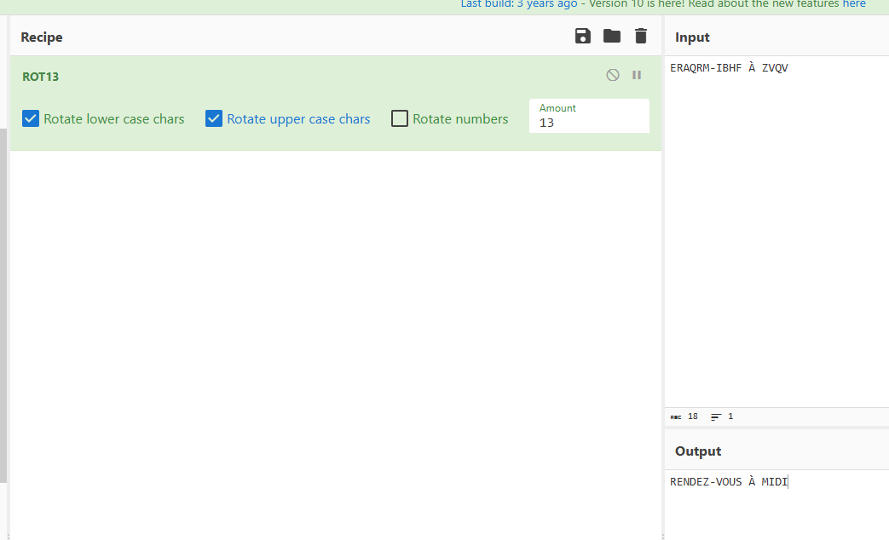


2. Chiffrer le nom de votre film préféré avec une « Box Height » de votre choix

- Transmettre le texte chiffré à votre binôme sans lui communiquer la clé

  - P jiol Pyhxynnu

- Au sein de votre binôme, essayer de retrouver le message en sens inverse 

### **Nicolas**

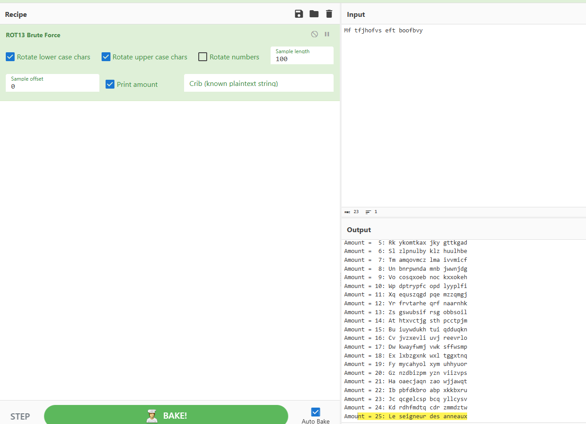

## Partie 2 : Vigenère

Dans « CyberChef » utilisez la recette « Vigenère Encode »

1. Encodez le nom de votre plat préféré avec la clé 'KEY'
- Quel est le texte chiffré ?

  - s'eagm dyf tkkdj

- Transmettre le texte chiffré à votre binôme

- Transmettre la clé à votre binôme par un autre canal
  
  - jesuisunecle

- Au sein de votre binôme, déchiffrez le message pour découvrir vos plats préférés
respectifs


### **Nicolas**

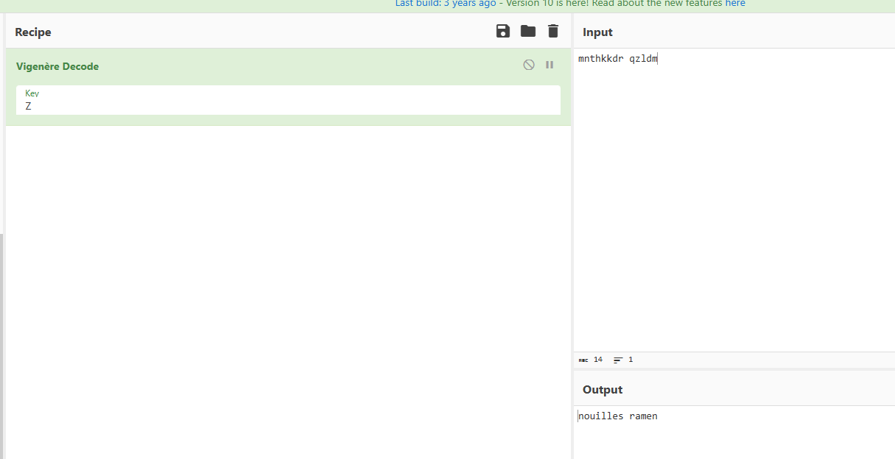

## Partie 3 : Chiffrement symétrique AES

Dans « CyberChef » utilisez les recettes « AES Encrypt » et « AES Decrypt »

Découverte

- Chiffrez la chaîne 'TESTSECRET1234567' avec les paramètres suivants
   - Key : c34fa73d7c5f8901a23e4cd98e7f650d9a17d4e8f902fa0d3286d0beaad219b6
   - IV :
   - Mode : ECB
   - Input : mode Raw
   - Output : Hex
- Que constatez-vous si vous modifiez 1 caractère du texte initial ?
   - la sortie change

  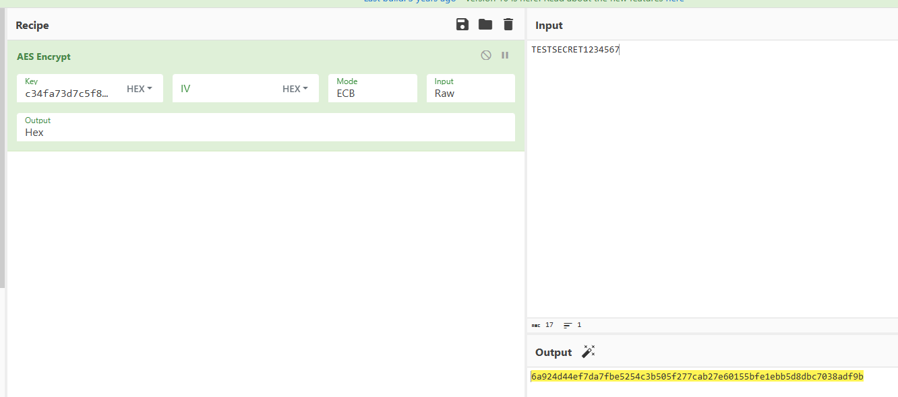 

- Déchiffrez le texte AES chiffré précédemment en adaptant les paramètres
- Vous devez retrouver le texte d'origine

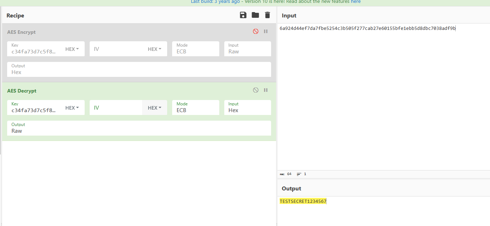

- Transmission d’un message chiffré à votre binôme
   - Générer une clé adéquate
- Chiffrez le nom de votre équipe de sport préférée avec les paramètres suivants
   - Key : 0C9BEBFA8B9A5F5DD1B4DE0184089800A449641CEA48D2E3D60323A41E30B748
   - IV :
   - Mode : ECB
   - Input : mode Raw
   - Output : Hex
   - Texte a dechiffre : 374654dbf76524cb1078a958ab3bcd14

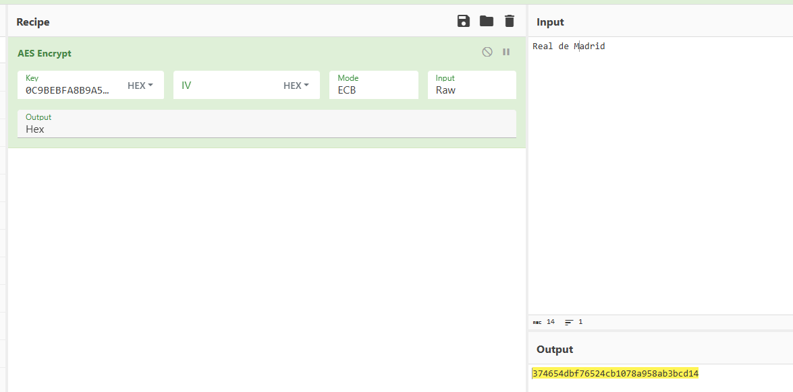

- Transmettre le texte chiffré à votre binôme
- Transmettre la clé à votre binôme par un autre canal

- Au sein de votre binôme, déchiffrez le message pour découvrir vos équipes de sport préférées respectives

### **Nicolas**

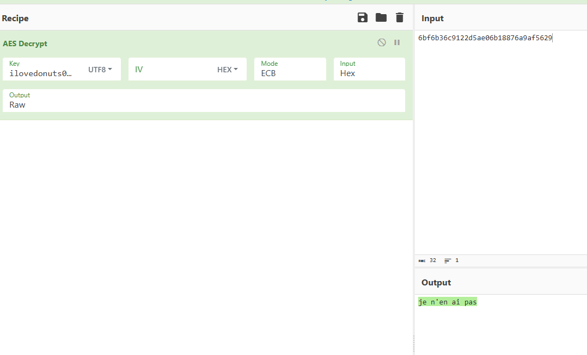

## Partie 4 : RSA

Dans « CyberChef » utilisez les recettes « Generate RSA Key Pair » « RSA Encrypt » et « RSA Decrypt »

Génération d’une paire de clés RSA


- Utilisez Generate RSA Key Pair avec une taille de 1024 bits

   - Que contiennent les clés générées ? (formats, longueur)

-----BEGIN PUBLIC KEY-----
MIGfMA0GCSqGSIb3DQEBAQUAA4GNADCBiQKBgQC1SHSH7Ytcg6p9VnnO+wQbeAx1
z4OJ6tCkUy6sNXrBI7wpdYl/3Vp1eA8q9oOD1wRcqSx8LOzx6M5QYStXGDenjIIG
WJpfiTgjs0CZG5HaumvPUO4dlpZRVjplDY+AOOY8mvoGiDyHvL7i10OPQn6uzMzd
m2n7myfOXaHOqRotKwIDAQAB
-----END PUBLIC KEY-----

Découverte

- Chiffrez le message suivant avec votre clé publique : LE MESSAGE EST SECRETSIMPLE
   - Quelle est la sortie chiffrée ? Mbh4yLkSLjP0uwqGpFs0OA4y5LP4c1Khwkma44SGE6Bn9EEhdDBuKqJu0dpOeWeN3BkKu21KkSHghcXyWzZqHvTJWaP6uQKgTbbl9l+xEjXdRrBUDoVWv0+t5/rZOcKnyPCMOtulaRe5w72CD6kJ42SlplT2MY4fZdTGfGaybKA=
   - Utilisez votre clé privée pour déchiffrer le message
   - La sortie est-elle identique au message d’origine ? Oui

  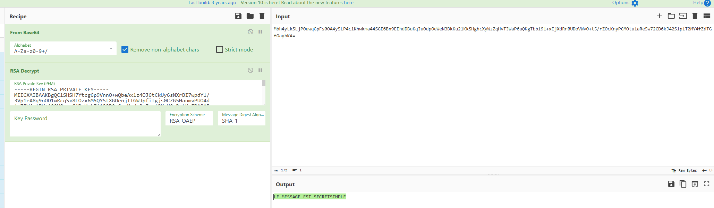

Transmission d’un message chiffré à votre binôme

- Récupérez la clé publique de votre binôme
   - Chiffrez votre réplique préférée avec les paramètres suivants
   - Key : « -----BEGIN PUBLIC KEY-----
MIGfMA0GCSqGSIb3DQEBAQUAA4GNADCBiQKBgQC4sfSKBC6S7bq01foHyDsaBMDb
4RNfC1nADmUFnanUTsDSJqFh8/3iHHchu6J2HYngF/dwg+MiESSAiN8NedTa8Kus
qxFGHeJU7QeLECubCr8QRYn78KcD87pXutJrtOItTGzbbUtSx28SCJuUYnME65HY
0ifXI11tJbuhoNExrQIDAQAB
-----END PUBLIC KEY-----
   - Encryption scheme : RSA-OAEP
   - Message Digest Algorithm : SHA-1

- Transmettre le texte chiffré à votre binôme
   - JS/akQlLSOGMqS1plgu3rwhqy2WqC3lnbP9yBPYRX41kvKUgXiWzs47mtlrZ3ME/HWNstD6DinmZT+7FYxaFZnx2JdowlSE4YiUSAtmDR1jD3amy4oBRACUNm4MLVZg/hppXyj5tJ2no7W2O5SuTTcIfuAxOvq3cJjzTawKCZSQ=

- Votre binôme, doit déchiffrer le message à l’aide de sa clé privée pour découvrir votre réplique préférée
- Inversez ensuite les rôles pour que chacun connaisse la réplique privée de son binôme

### **Nicolas**

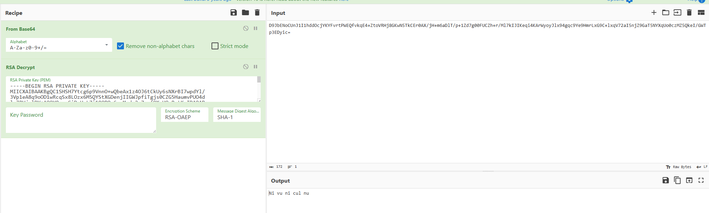


## Partie 5 : Hachage
- Utilisez différents algorithmes de hachage sur la chaîne ADMIN123
   - SHA-1 93a6682a45cca19a71a8c9e3015e0c4b3a80e22c
   - SHA-2 : 256, 512 5b40171489659251097e7790fc2f1892e2183a72546fe1df283d07865db9149c , 25974977f6b51e4e8707e78281ba9b19ec54357901d51383658c57e3747d72a2fe00b3bb2e20d310cbbe1c49a0b6bb71df9f047a6253875041ea567bc85b2fcd
   - SHA-3 : 256, 512 5bddba0700f67dc277fc021c256d888275f9c47f3e8d92752112ddd30edd5743 , 8d224b1287f5e84fbd9d14e493a14d91179c3111de584a2937f1ec76f82d9dccec4b33dad54dca5ab905443210c2d3067b00367c304be18705d0ff6d1be0399f

- Quelles sont les tailles des hashs produits ?

SHA-1	    160 bits

SHA-256	    256 bits

SHA-512	    512 bits

SHA3-256	256 bits

SHA3-512	512 bits	

- Est-il possible de retrouver le mot de passe à partir du hash ? Oui
- Essayez deux textes légèrement différents (TEST et TESt)
- Que constatez-vous dans les résultats des hashs ? ils ont changer
- Hacher le texte « hello » en SHA1 (80 rounds) : aaf4c61ddcc5e8a2dabede0f3b482cd9aea9434d
- Crackez le hash sur https://crackstation.net/
- Le hash est cracké en quelques secondes, comment cela est-ce possible ? Car il fait parti d'une liste , du coup le hash est deja connu 
- Répéter le point précédent avec SHA1 (50 rounds)
- Le hash est-il cracké ? Pourquoi ? Non il n'est pas cracké car il ne reconnais pas le hash dans sa liste car les parametres de chiffrement on changer .

## Partie 6 : Encodage
- Encodez le mot « Bonjour » en base 64
   - Que représente le résultat ? Qm9uam91cg==

 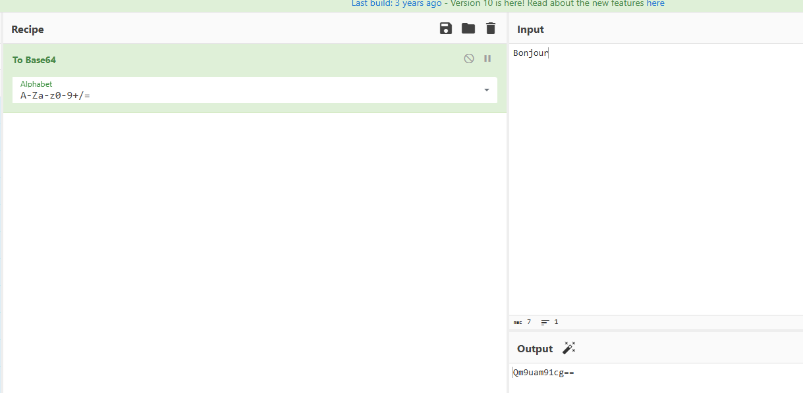 

- Décoder le résultat obtenu précédemment

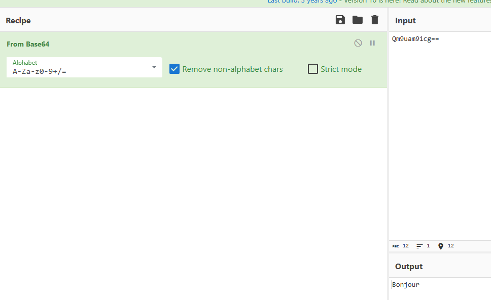

- Peut-on confondre encodage et chiffrement ? Pourquoi ? Non le chiffrement necessite une clé alors que l'encodage non 

## Bonus
- Le diaporama contient un message caché, tentez de le découvrir !
- Indice : plusieurs opérations utilisées dans le cadre de ce TP ont été utilisées pour cacher ce message…

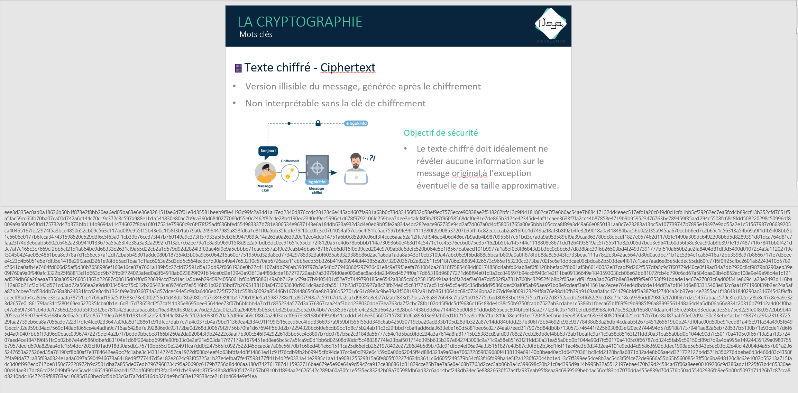

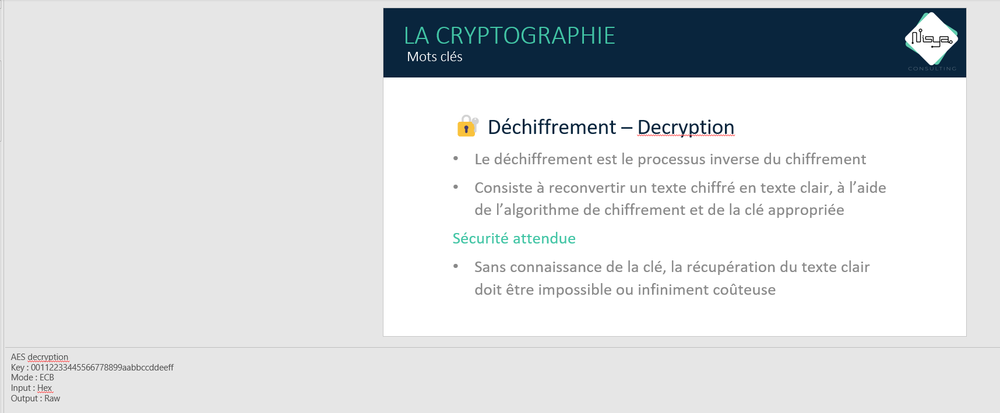

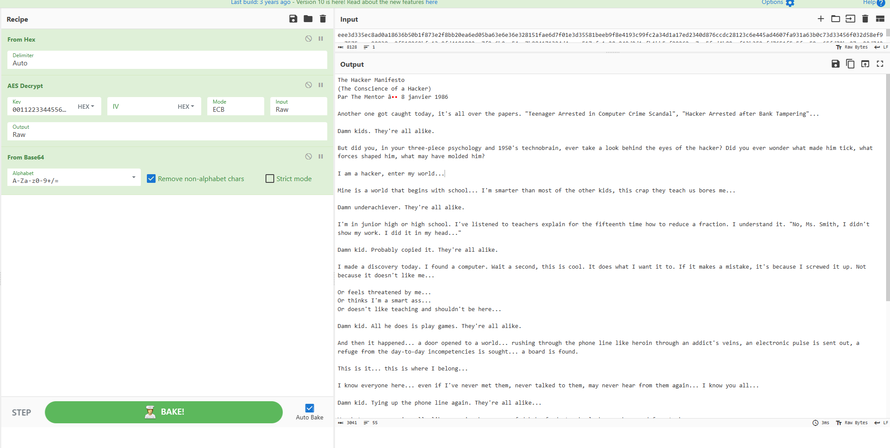

- Avec le Hash en MD5

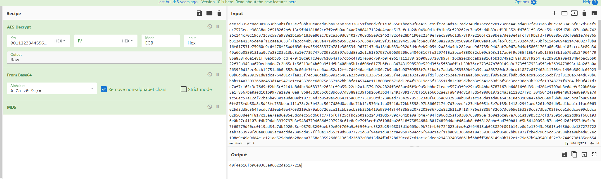

# TP2 AES et RSA avec Open SSL

## Partie 1 : Chiffrement symétrique AES

**En utilisant OpenSSL**

### A.Découverte


- Chiffrez la chaîne 'TESTSECRET1234567' avec les paramètres suivants
   - Mode de chiffrement AES 256 bits en CBC
   - Sortie en base64
   - Ajouter un sel (salt) pour sécuriser la dérivation de clé
   - Fournir une passphrase (pour dériver la clé)

 ```bash
echo -n "TESTSECRET1234567" | openssl enc -aes-256-cbc -salt -pbkdf2 -base64 -pass pass:"lacryptocestgenial"
```

   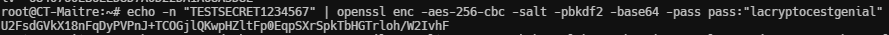

- Quelle est la clé réelle utilisée et comment est-elle générée ?

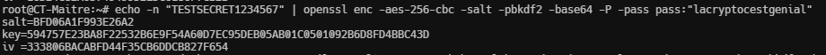

La clé réelle utilisée et la "KEY" et elle est générée automatiquement

- Déchiffrez le texte AES chiffré précédemment en adaptant les paramètres

```bash
echo "U2FsdGVkX18nFqDyPVPnJ+TCOGjlQKwpHZltFp0EqpSXrSpkTbHGTrloh/W2IvhF" | openssl enc -d -aes-256-cbc -pbkdf2 -base64 -pass pass:"lacryptocestgenial"
```
   - Vous devez retrouver le texte d'origine

### B. Transmission d’un message chiffré à votre binôme (passphrase)


```bash
root@CT-Maitre:~# echo -n "je m'en fou des voitures" | openssl enc -aes-256-cbc  -pbkdf2 -base64 -pass pass:"vroumvroum"
```
- Chiffrez le nom de votre voiture préférée avec les paramètres suivants
   - Mode de chiffrement AES 256 bits en CBC
   - Sortie en base64
   - Ne pas ajouter de sel (salt) pour sécuriser la dérivation de clé
   - Fournir une passphrase (pour dériver la clé)

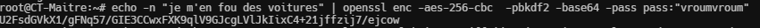

- Transmettre le texte chiffré à votre binôme
- Transmettre la passphrase à votre binôme par un autre canal

- Au sein de votre binôme, déchiffrez le message pour découvrir vos voitures
préférées respectives

#### **Nicolas**

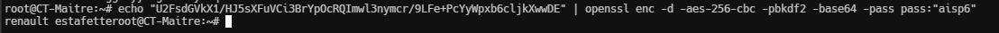

### C.Transmission d’un message chiffré à votre binôme

- Générez une clé de chiffrement et un vecteur d'initialisation (IV) à partir d’une passphrase sans
sel

```bash
openssl enc -aes-256-cbc -nosalt -pbkdf2 -P -pass pass:"musique"
```

   - Notez les valeurs renvoyées

 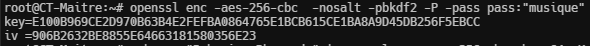  

- Chiffrez le nom de votre chanson préférée en utilisant la clé et l’IV générés précédemment
```bash
echo -n "Bohemian Rhapsody" | openssl enc -aes-256-cbc -base64 -K E100B969CE2D970B63B4E2FEFBA0864765E1BCB615CE1BA8A9D45DB256F5EBCC -iv 906B2632BE8855E64663181580356E23
```

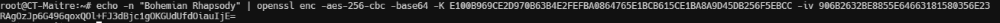

- Transmettre le texte chiffré à votre binôme
- Transmettre la clé et l’IV à votre binôme par un autre canal

   - Au sein de votre binôme, déchiffrez le message pour découvrir votre chanson
préférée respective

```bash
echo "yPU9P+3CQT+wDvK2P79ETRdXeeOnChn224hpXHtItks=" | openssl enc -d -aes-256-cbc -base64 -K E20458E08464955B200E6F07F79E87993AA11DAF97B5CBABFB3ADB6A9144F5E3 -iv 1E67EC9C18ED0FF43B9B597DF57DE86B
```

#### **Nicolas**

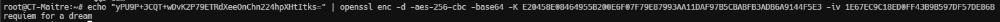


## Partie 2 : RSA

En vous inspirant de l’exercice AES, réalisez l’équivalent avec RSA :

### A. Génération de la paire de clés RSA

- Générez une paire de clés RSA de 2048 bits

```bash
openssl genpkey -algorithm RSA -out private_key.pem -pkeyopt rsa_keygen_bits:2048
```

- Extraire la clé publique

```bash
openssl pkey -in private_key.pem -pubout -out public_key.pem
```

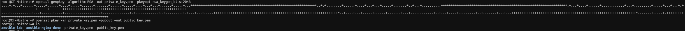

### B. Chiffrement d’un message

- Écrivez un court message (ex. : le nom de votre destination de tourisme préférée)

```bash
echo -n "MESSAGE" > message.txt
```

- Chiffrez-le avec la clé publique de votre binôme

```bash
openssl pkeyutl -encrypt -pubin -inkey public_key_binome.pem -in message.txt -out message_rsa.bin
```

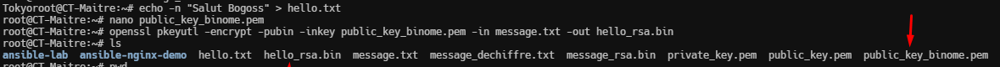

### C. Échange et déchiffrement

- Transmettez le fichier chiffré (message_rsa.bin) à votre binôme.
- Votre binôme doit déchiffrer le message avec sa clé privée

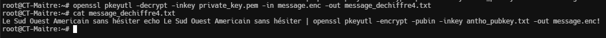

## Partie 3 : BONUS

- Utilisez le chiffrement hybride pour transmettre à votre binôme les paroles de votre chanson préférée !

Le chiffrement hybride combine :
- **AES** → pour chiffrer les données (rapide)
- **RSA** → pour chiffrer la clé AES (sécurisé)

## 1. Génération des clés RSA (binôme)

```bash
openssl genpkey -algorithm RSA -out private_key.pem -pkeyopt rsa_keygen_bits:2048
openssl pkey -in private_key.pem -pubout -out public_key.pem
```


## 2. Génération clé AES + IV

```bash
openssl rand -hex 32 > aes_key.hex
openssl rand -hex 16 > aes_iv.hex
```


## 3. Chiffrement des données (AES-256-CBC)

```bash
openssl enc -aes-256-cbc -in paroles.txt -out paroles_chiffrees.bin \
-K $(cat aes_key.hex) -iv $(cat aes_iv.hex)
```
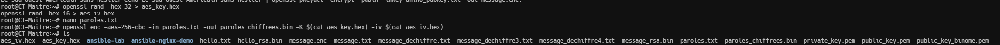

## 4. Chiffrement de la clé AES (RSA)

```bash
openssl pkeyutl -encrypt -pubin -inkey public_key_binome.pem \
-in aes_key.hex -out aes_key_chiffree.bin
```


## 5. Transmission

Envoyer au binôme :

- `paroles_chiffrees.bin`
- `aes_key_chiffree.bin`
- `aes_iv.hex`

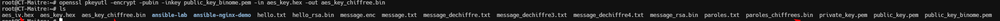

## 6. Déchiffrement de la clé AES (RSA)

```bash
openssl pkeyutl -decrypt -inkey private_key.pem \
-in aes_key_chiffree.bin -out aes_key_dechiffree.hex
```


## 7. Déchiffrement des données (AES)

```bash
openssl enc -d -aes-256-cbc -in paroles_chiffrees.bin \
-out paroles_dechiffrees.txt \
-K $(cat aes_key_dechiffree.hex) -iv $(cat aes_iv.hex)
```
## 8. Lecture des paroles

```bash
cat paroles_dechiffrees.txt
```

#### **Nicolas**

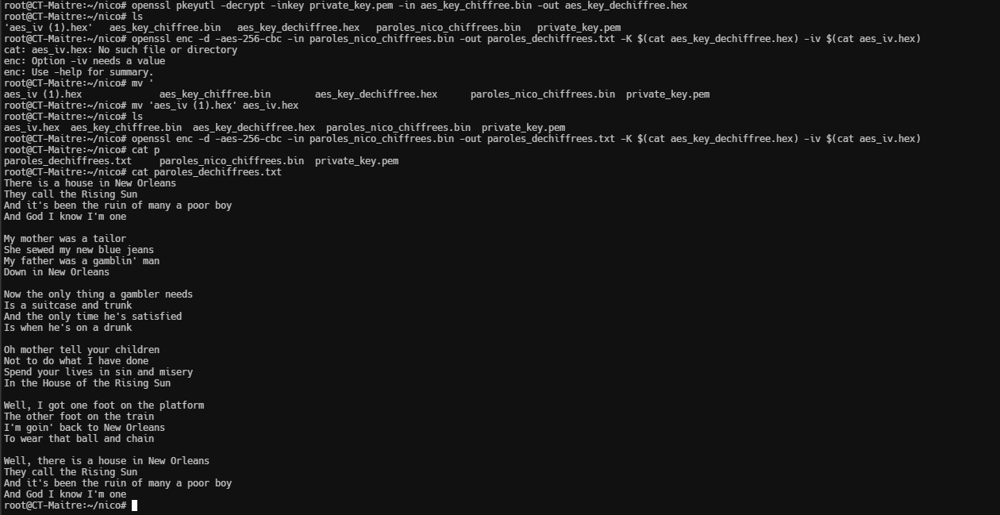

# TP3 SSH

## Partie1 : Configuration initiale

**Génération de la clé SSH**

- Générer une paire de clé RSA 4096

```bash
ssh-keygen -t rsa -b 4096 -C
```
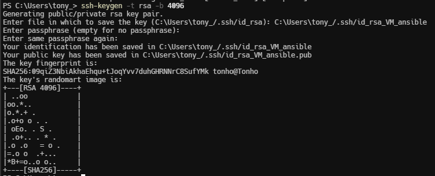

   - Deux fichiers doivent être générés :
     - id_rsa (clé privée, à ne pas partager)
     - id_rsa.pub (clé publique)

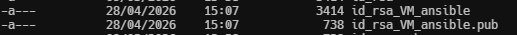


- Dépôt de la clé publique dans le serveur distant

```bash
scp ~/.ssh/id_rsa_VM_ansible.pub root@192.168.1.13:~
```
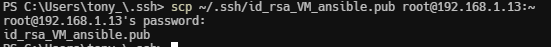

   - Copier `id_rsa.pub` dans le home de l'utilisateur
   - Déplacer la clé à l'emplacement correct et ajuster les droits (créer les dossiers nécessaires
le cas échéant)

```bash
cat ~/id_rsa_VM_ansible.pub >> ~/.ssh/authorized_keys
chmod 700 ~/.ssh
chmod 600 ~/.ssh/authorized_keys
```
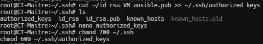

- Configuration du serveur pour forcer l’authentification par clé

```bash
sudo nano /etc/ssh/sshd_config
```
- Adapter le fichier de configuration ssh pour forcer l’authentification par clé uniquement
```
PermitRootLogin prohibit-password
PubkeyAuthentication yes
PasswordAuthentication no

```
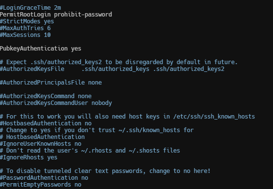

- Redémarrer le service SSH pour appliquer la configuration
   
```bash
sudo systemctl restart ssh
```

## Partie2 : Validation du fonctionnement

- Connectez-vous au serveur sans mot de passe à l’aide de votre clé privée

```bash
 ssh -i $env:USERPROFILE\.ssh\id_rsa_VM_ansible root@192.168.1.13
```
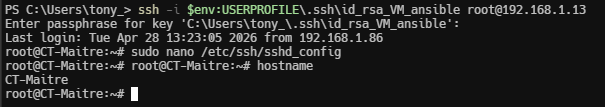

- Répondez aux questions suivantes :

  - Ce qui se passe si vous supprimez la clé privée 
     - On ne peut plus se connecter au serveur.

  - Comment réactiver l'authentification par mot de passe en cas de besoin
     - il faut passer le champ "PasswordAuthentication" de "no" à "yes", et redemarrer les services.

## Supplement : Créer un alias SSH

- Dans le Dossier .ssh creer un fichier config avec le bloc notes et supprimer l'extension .txt
  - Ouvrez ce fichier et coller :
```
Host NOM_CHOISI "ex: VM"
    HostName IP du serveur 
    User Nom de l'user
    Port 22 par default 
    IdentityFile Chemin\de\la\cle\privee
```
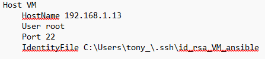

- Test de connexion

```bash
 ssh VM
```
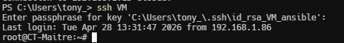

## Partie 3 : Bonus

- Activation et utilisation de ssh-agent

- Quel est le rôle de ssh-agent ?
 - Stocker les clés privées en mémoire
 - Éviter de taper la passphrase à chaque connexion
 - Gérer plusieurs clés facilement

 - Configurez et testez ssh-agent
     - Sur l’OS Windows

 ```bash
ssh-add $env:USERPROFILE\.ssh\id_rsa_VM_ansible
```
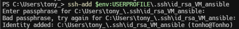

- Test de Connexion IP + Alias

  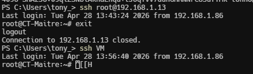


# TP4 RockYou John

- Vous devez cracker les différents fichiers mis à votre disposition

- Utiliser pour cela John The Ripper et la wordlist « RockYou »

- Pour chaque hash je vais utiliser le script .py pour s'avoir quelle format de hash est utilisé.

```bash
python3 hash-id.py
```
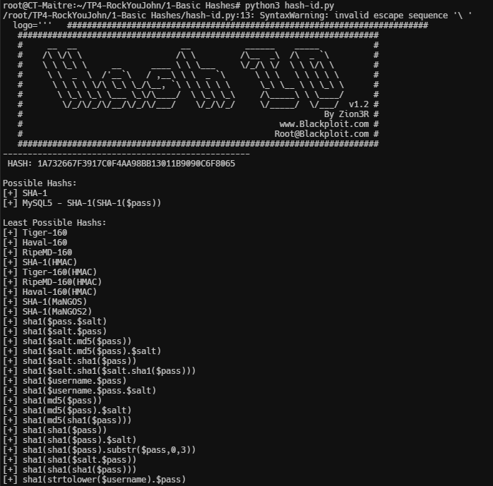

##  Crack du hash1.txt (MD5)

### Commande utilisée
```bash
./john --format=raw-md5 --wordlist=/root/rockyou.txt "/root/TP4-RockYouJohn/1-Basic Hashes/hash1.txt"
```

### Résultat obtenu
```
biscuit
```
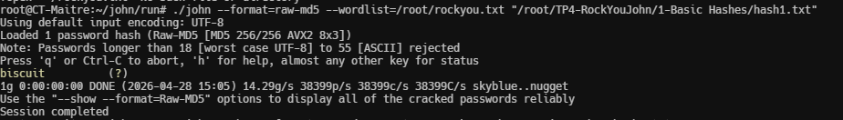

##  Crack du hash2.txt (SHA1)

### Commande utilisée
```bash
./john --format=raw-sha1 --wordlist=~/rockyou.txt "/root/TP4-RockYouJohn/1-Basic Hashes/hash2.txt"
```

### Résultat obtenu
```
kangeroo
```
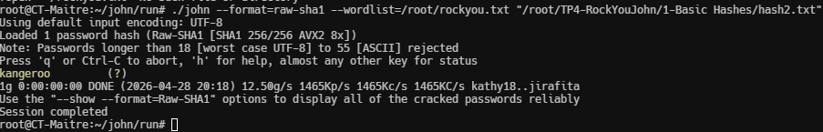

##  Crack du hash3.txt (SHA256)

### Commande utilisée
```bash
./john --format=raw-sha256 --wordlist=/root/rockyou.txt "/root/TP4-RockYouJohn/1-Basic Hashes/hash3.txt"
```

### Résultat obtenu
```
microphone
```
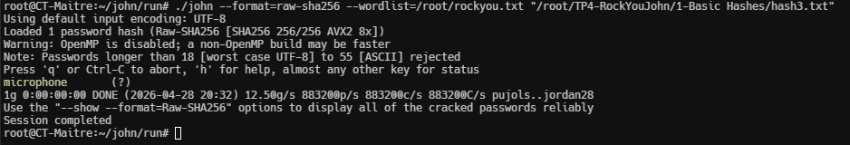

##  Crack du hash4.txt (Whirlpool)

### Commande utilisée
```bash
./john --format=whirlpool --wordlist=/root/rockyou.txt --rules "/root/TP4-RockYouJohn/1-Basic Hashes/hash4.txt"
```

### Résultat obtenu
```
colossal
```
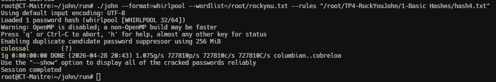

##  Crack du ntlm.txt

### Commande utilisée
```bash
./john --format=nt --wordlist=/root/rockyou.txt  /root/TP4-RockYouJohn/2-Windows\ Authentication\ Hashes/ntlm.txt
```

### Résultat obtenu
```
mushroom
```
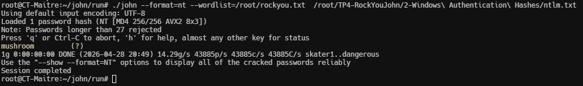

##  Crack du shadow

### Commande utilisée

```bash
cd "/root/TP4-RockYouJohn/3-Shadow Hashes"
~/john/run/unshadow local_passwd local_shadow > unshadowed.txt
```
Puis

```bash
cd ~/john/run
./john --wordlist=/root/rockyou.txt "/root/TP4-RockYouJohn/3-Shadow Hashes/unshadowed.txt"
```
### Résultat obtenu
```
1234 (root)
```
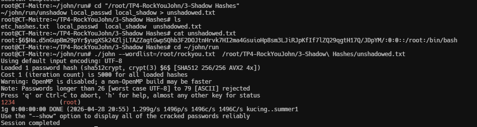

##  Crack du hash07.txt (MD5)

### Commande utilisée

```bash
./john --format=raw-md5 --wordlist=/root/rockyou.txt --rules /root/TP4-RockYouJohn/4-Single\ Crack/hash07.txt
```
*On rajoute "-- rules" cela permet de modifier automatiquement les mots du dictionnaire pour tester des variantes.*

### Résultat obtenu
```
Jok3r
```
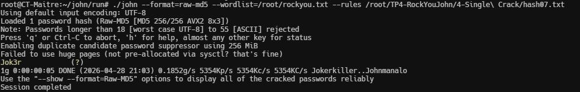

##  Crack du secure.zip

### Commande utilisée

```bash
~/john/run# ./zip2john "/root/TP4-RockYouJohn/5-Zip File/secure.zip" > zip.hash
```
Puis

```bash
./john --wordlist=/root/rockyou.txt zip.hash
```
### Résultat obtenu
```
pass123
```
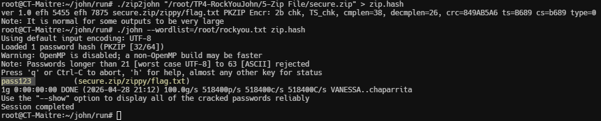

##  Crack du secure.rar

### Commande utilisée

```bash
./rar2john /root/TP4-RockYouJohn/6-RAR\ File/secure.rar > rar.hash
```
Puis

```bash
./john --wordlist=/root/rockyou.txt rar.hash
```
### Résultat obtenu
```
password
```
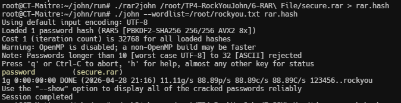

##  Crack du id.rsa (SSH)

### Commande utilisée

```bash
python3 ./ssh2john.py "/root/TP4-RockYouJohn/7-SSH Key/id_rsa" > ssh.hash
```
Puis

```bash
./john --wordlist=/root/rockyou.txt ssh.hash
```
### Résultat obtenu
```
mango
```
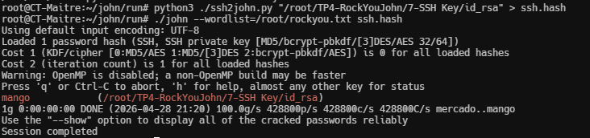


# TP5 :  Déploiement d'une PKI et d'un Serveur Web Sécurisé (LXC sur Proxmox)

## Architecture et Prérequis

Vous allez déployer 3 conteneurs LXC sur Proxmox. Ces conteneurs seront connectés à un Bridge Linux (qui simule votre switch) et placés derrière un firewall pfSense virtuel.


*   **CT 1 (DNS)** : IP `192.168.100.20`
*   **CT 2 (PKI)** : IP `192.168.100.21`
*   **CT 3 (WEB)** : IP `192.168.100.22`
*   **VM 1 (Client)** : IP `192.168.100.10`

---

## Étape 1 : Création des Conteneurs LXC sur Proxmox

Pour chaque service (DNS, PKI, WEB), créez un conteneur LXC en suivant cette procédure depuis l'interface Proxmox :

1.  Cliquez sur **Create CT** en haut à droite.
2.  **General** :
    *   Hostname : `dns`, `pki` ou `web` (selon le conteneur).
    *   Password : Définissez un mot de passe pour l'utilisateur `root`.
3.  **Template** : Sélectionnez un template récent de distribution Linux (ex: Debian 12).
4.  **Disks** : 8 Go (par défaut) sont amplement suffisants.
5.  **CPU / Memory** : 1 Core et 512 Mo de RAM par conteneur suffisent pour ces services.
6.  **Network** :
    *   **Bridge** : Sélectionnez le bridge correspondant au LAN de votre pfSense (ex: `vmbr1`).
    *   **IPv4** : Statique. Entrez l'IP prévue avec son masque (ex: `192.168.33.20/24`).
    *   **Gateway** : Entrez l'adresse IP LAN de votre pfSense.
7.  **DNS Server** : Laissez par défaut ou pointez vers votre pfSense pour le moment (vous les modifierez plus tard).
8.  Démarrez vos conteneurs.

*(Note : Assurez-vous que le paquet `ssh` est bien installé et démarré sur vos conteneurs pour la suite de l'exercice).*

---

## Étape 2 : Exécution des scripts d'installation

Connectez-vous en `root` sur chacun de vos conteneurs et exécutez les scripts correspondants. 

### 1. Sur le conteneur DNS (`192.168.100.20`)

Créez le script `install_dns.sh`, rendez-le exécutable (`chmod +x install_dns.sh`) et lancez-le :

```bash
#!/bin/bash

# --- VARIABLES A ADAPTER ---
IP_DNS="192.168.100.20"
IP_PKI="192.168.100.21"
IP_WEB="192.168.100.22"
RESEAU_AUTORISE="192.168.0.0/16" # Adaptez à votre sous-réseau
# ---------------------------

# Ajout des entrées dans /etc/hosts
echo "$IP_DNS dns.simplon.local" | tee -a /etc/hosts
echo "$IP_PKI pki.simplon.local" | tee -a /etc/hosts
echo "$IP_WEB web.simplon.local" | tee -a /etc/hosts

# Mise à jour des paquets et installation de Bind9
apt update
apt install -y bind9 bind9utils bind9-doc

# Configuration des options de Bind9
cat << EOF | tee /etc/bind/named.conf.options
options {
    directory "/var/cache/bind";
    listen-on { any; };
    allow-query { 10.0.0.0/8; 172.16.0.0/12; $RESEAU_AUTORISE; };
    listen-on-v6 { none; };
    recursion yes;
};
EOF

# Configuration de la zone simplon.local
echo 'zone "simplon.local" {
    type master;
    file "/etc/bind/db.simplon.local";
};' | tee /etc/bind/named.conf.local

# Création du fichier de zone
touch /etc/bind/db.simplon.local

echo "\$TTL    604800
@       IN      SOA     dns.simplon.local. root.simplon.local. (
                          2         ; Serial
                     604800         ; Refresh
                      86400         ; Retry
                    2419200         ; Expire
                     604800 )       ; Negative Cache TTL
;
@       IN      NS      dns.simplon.local.
@       IN      A       $IP_DNS
dns     IN      A       $IP_DNS
pki     IN      A       $IP_PKI
web     IN      A       $IP_WEB" | tee /etc/bind/db.simplon.local

# Vérification et redémarrage
named-checkconf
named-checkzone simplon.local /etc/bind/db.simplon.local
systemctl restart named
systemctl enable named
systemctl status named --no-pager
```

### 2. Sur le conteneur PKI (`192.168.100.21`)

Créez le script `install_pki.sh`, rendez-le exécutable et lancez-le :

```bash
#!/bin/bash

# --- VARIABLES A ADAPTER ---
IP_DNS="192.168.100.20"
IP_PKI="192.168.100.21"
IP_WEB="192.168.100.22"
# ---------------------------

echo "$IP_DNS dns.simplon.local" | tee -a /etc/hosts
echo "$IP_PKI pki.simplon.local" | tee -a /etc/hosts
echo "$IP_WEB web.simplon.local" | tee -a /etc/hosts

set -e
set -x

DOMAIN="simplon.local"
HOSTNAME="pki.simplon.local"

echo 'START of Install_stepCA.sh script' "$HOSTNAME" "$(hostname -I | awk '{print $1}')"

# Update resolv.conf
echo "[PKI 1] Updating resolv.conf"
{
    cat > /etc/resolv.conf << EOF
domain $DOMAIN
search $DOMAIN
nameserver $IP_DNS
nameserver 8.8.8.8
EOF
} || { echo "Failed to update resolv.conf"; exit 1; }

# Install step-ca
echo "[PKI 2] Installing step-ca"
{
    apt update && apt install -y wget
    wget -q https://dl.step.sm/gh-release/cli/doc-ca-install/v0.19.0/step-cli_0.19.0_amd64.deb && dpkg -i step-cli_0.19.0_amd64.deb
    wget -q https://dl.step.sm/gh-release/certificates/doc-ca-install/v0.19.0/step-ca_0.19.0_amd64.deb && dpkg -i step-ca_0.19.0_amd64.deb
} || { echo "Failed to install step-ca"; exit 1; }

# Configure step-ca
echo "[PKI 3] Configuring step-ca"
{
    echo "password" > /root/password.txt
    step ca init --ssh --deployment-type=standalone --name="Pki" --dns=$HOSTNAME --address=:8443 --provisioner=admin@$DOMAIN --password-file=/root/password.txt
} || { echo "Failed to configure step-ca"; exit 1; }

# Update the step path
mv $(step path) /etc/step-ca
sed -i "s|/root/.step|/etc/step-ca|g" /etc/step-ca/config/defaults.json
sed -i "s|/root/.step|/etc/step-ca|g" /etc/step-ca/config/ca.json

# Create a system user for step-ca
useradd --system --home /etc/step-ca --shell /bin/false step
chown -R step:step /etc/step-ca

# Setup systemd and start service
echo "[PKI 4] Configuring systemd and starting the service"
wget -q https://raw.githubusercontent.com/smallstep/certificates/master/systemd/step-ca.service
mv step-ca.service /etc/systemd/system/
export STEPPATH=/etc/step-ca
echo STEPPATH=/etc/step-ca > /etc/environment
systemctl daemon-reload
systemctl enable --now step-ca
mv /root/password.txt /etc/step-ca/

# Add ACME provisioner
step ca provisioner add acme --type ACME
systemctl restart step-ca.service

echo "step-CA installation and configuration complete."
```

### 3. Sur le conteneur WEB (`192.168.100.22`)

Créez le script `install_web.sh`, rendez-le exécutable et lancez-le :

```bash
#!/bin/bash

# --- VARIABLES A ADAPTER ---
IP_DNS="192.168.100.20"
IP_PKI="192.168.100.21"
IP_WEB="192.168.100.22"
# ---------------------------

echo "$IP_DNS dns.simplon.local" | tee -a /etc/hosts
echo "$IP_PKI pki.simplon.local" | tee -a /etc/hosts
echo "$IP_WEB web.simplon.local" | tee -a /etc/hosts

# Résolution DNS locale pointant vers le conteneur DNS
cat > /etc/resolv.conf << EOF
domain simplon.local
search simplon.local
nameserver $IP_DNS
nameserver 8.8.8.8
EOF

# Mise à jour des paquets et installation d'Apache
apt-get update
apt-get install -y apache2 wget ssh

# Création du dossier de log pour Apache2
mkdir -p /var/log/apache2

# Création de la configuration Apache
cat << EOF | tee /etc/apache2/sites-available/web.simplon.local.conf
<VirtualHost *:80>
    ServerName web.simplon.local
    ServerAlias www.web.simplon.local
    DocumentRoot /var/www/html

    ErrorLog \${APACHE_LOG_DIR}/error.log
    CustomLog \${APACHE_LOG_DIR}/access.log combined
</VirtualHost>
EOF

# Activation du site et modules
a2ensite web.simplon.local.confsys
a2dissite 000-default.conf
a2enmod rewrite
systemctl reload apache2

# Installation de Certbot
apt-get install -y certbot python3-certbot-apache

echo "Apache server setup completed."
```

---

## Étape 3 : Exercice Pratique

### A. Informations sur l'infrastructure

*   **PKI** : L'autorité de certification exécute Smallstep. Elle est configurée pour émettre des certificats SSL (ACME). Le certificat racine est dans `/etc/step-ca/certs`.
*   **WEB** : Exécute Apache2, configuré pour répondre sur `[http://web.simplon.local](http://web.simplon.local)`.

### B. Configuration de la VM Client (hôte)

Une fois les conteneurs déployés, vous devez pouvoir accéder au site web depuis une VM Debian ou Windows dans le même segment réseau que l'infra PKI.
⚠️ **Action requise** : Changez la configuration de votre carte réseau pour utiliser **l'IP de votre conteneur DNS** comme DNS primaire (ex: `192.168.100.20`).

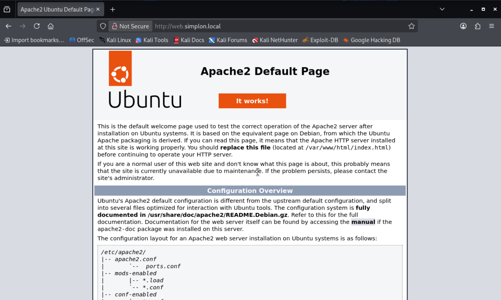

### C. Test HTTP et Capture

1.  Ouvrez **Wireshark** sur votre VM Client et lancez une capture sur l'interface réseau connectée au réseau du lab.
2.  Ouvrez votre navigateur et allez sur `[http://web.simplon.local](http://web.simplon.local)`.
3.  Observez le trafic en clair dans Wireshark (Filtre : `http`).

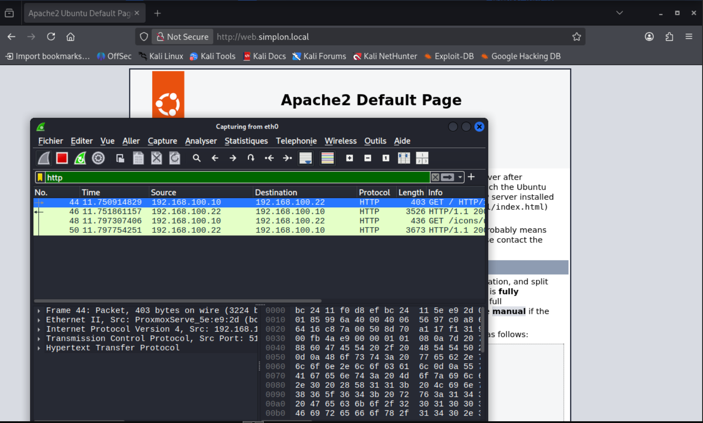

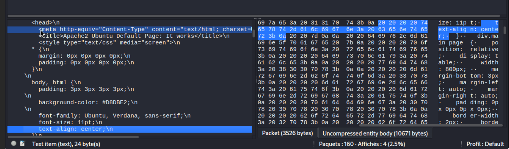

### D. Mise en place du SSL

Votre objectif : Mettre en place SSL sur le serveur web à l'aide de Certbot et de votre autorité PKI interne.
*   **Que constatez-vous lors du premier test en HTTPS ?** il nous dis que le site ne reconnais pas le certificat et que cela peut etre dangereux de se connecter sur le site 

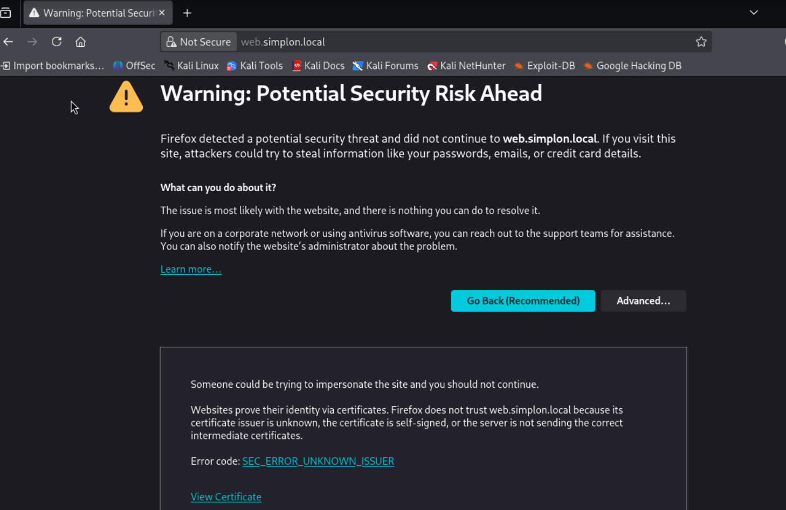


*   **Comment résoudre le problème lié au certificat auto-signé / autorité inconnue ?** Il faut importer le certificat dans le navigateur pour lui dire que ce certificat et valide


### 1. Importer l'autorité de certification (CA) sur le serveur WEB

Pour que le serveur Web (et Certbot) fasse confiance à notre PKI interne, il faut lui transmettre le certificat racine.

**Sur le serveur PKI :**
Vérifiez la présence des certificats, puis copiez le certificat racine vers le serveur Web :
```bash
cd /etc/step-ca/certs/
ls -l

# On autorise temporairement la connexion SSH root sur le serveur Web (si bloquée par défaut)
# Note: Si scp bloque, faites cette modification sur le serveur WEB d'abord :
# sed -i 's/#PermitRootLogin prohibit-password/PermitRootLogin yes/g' /etc/ssh/sshd_config
# systemctl restart ssh

# Envoi du certificat (Adaptez l'IP du serveur web)
scp root_ca.crt root@192.168.100.22:/root/
```
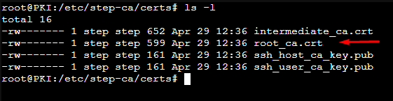

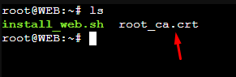

**Sur le serveur WEB :**
Déplacez le certificat reçu et mettez à jour le magasin de confiance de Debian :
```bash
mv /root/root_ca.crt /usr/local/share/ca-certificates/pki_root_ca.crt
update-ca-certificates
```
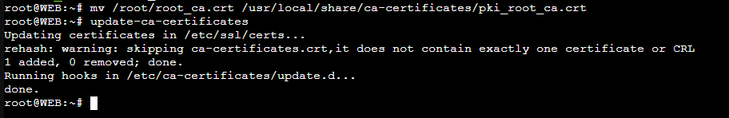

### 2. Obtenir et déployer le certificat SSL avec Certbot

**Toujours sur le serveur WEB :**
Lancez Certbot en lui indiquant l'URL ACME de votre PKI interne :
```bash
certbot --apache --server https://pki.simplon.local:8443/acme/acme/directory
```
*   **Email** : Renseignez un email (ex: `admin@simplon.local`).
*   **Terms of Service** : Acceptez (A).
*   **EFF** : Refusez (N).
*   **Names** : Sélectionnez `simplon.local` (ou tapez 1).
*   **Redirect** : Choisissez `2` (Redirect) pour forcer tout le trafic HTTP vers HTTPS.

### 3. Test HTTPS et Validation Client

1.  Lancez une nouvelle capture Wireshark.
2.  Allez sur `[https://web.simplon.local/](https://web.simplon.local/)`.
3.  **Analyse** : Le trafic est désormais chiffré. Quel protocole est utilisé ? HTTP avec OverTLS  (Regardez dans Wireshark, vous devriez voir du `TLS 1.3`).
Normalement vous devez voire du TLS 1.3. Si ce n’est pas le cas, votre navigateur n’est pas a jour ou est mal configuré


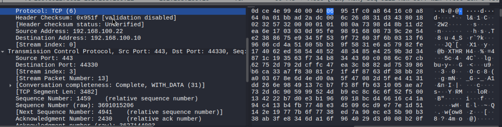

Dans Chrome, taper > chrome://flags/#tls13-variant
4.  **Alerte de sécurité du navigateur** : Votre navigateur affichera un avertissement de sécurité. C'est normal, votre VM Client ne connaît pas encore la PKI interne !
5.  **Résolution côté client** :
    *   Depuis votre VM Client, rendez-vous sur l'URL : `[https://pki.simplon.local:8443/roots.pem](https://pki.simplon.local:8443/roots.pem)`
    *   Le certificat racine se télécharge.
    *   Importez-le dans le magasin de certificats de votre système d'exploitation ou directement dans les paramètres de votre navigateur (Autorités de certification de confiance).
    *   Rechargez la page web : le cadenas vert doit s'afficher.

    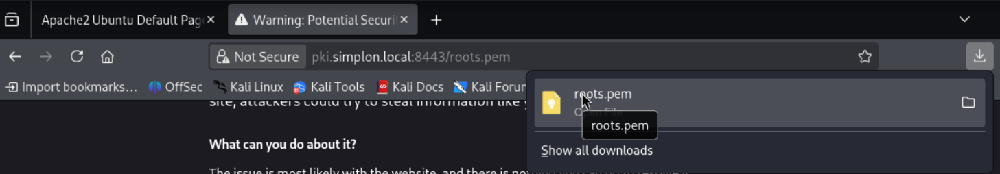

    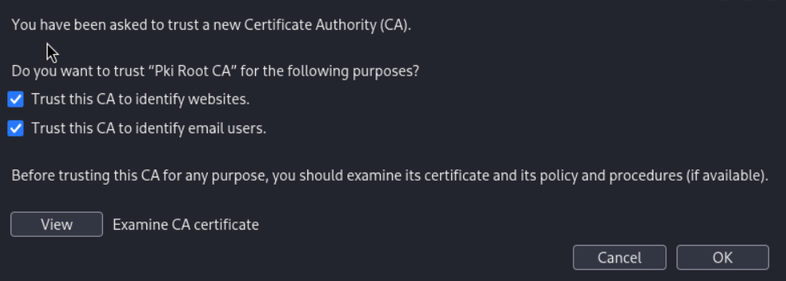

    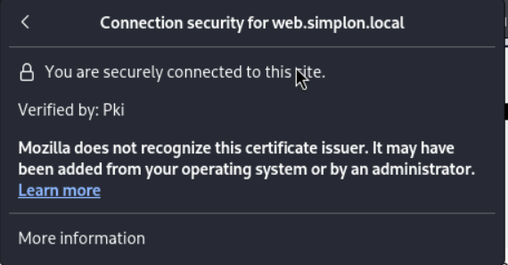

    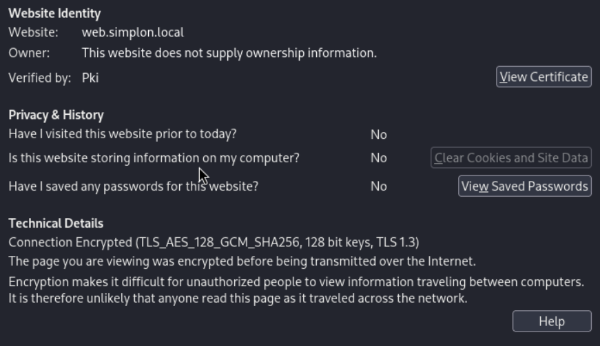

    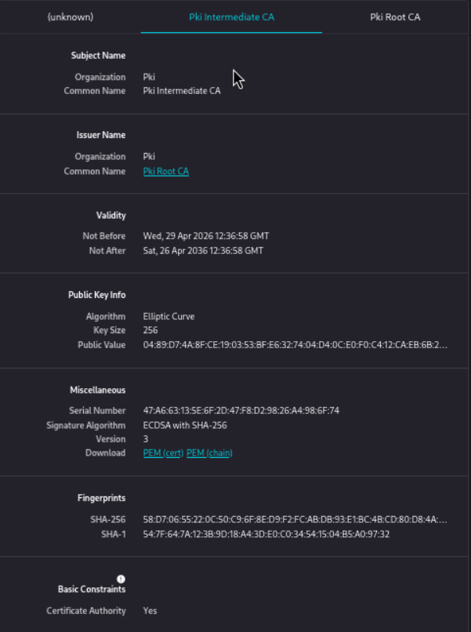

    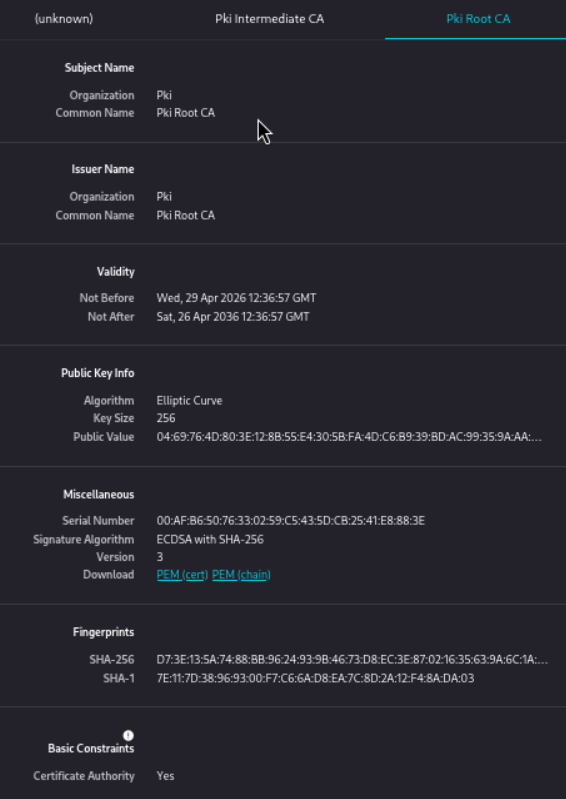
  