# Déploiement d'un WAF ModSecurity de niveau production avec Apache sur Ubuntu 24.04

### **1.0 Section 1 : Préparation de l'environnement de base**

Avant de déployer des contrôles de sécurité avancés, il est impératif de s'assurer que le système d'exploitation et les services sous-jacents sont correctement configurés et sécurisés.

#### **1.1 Provisionnement du système et sécurité de base sur Ubuntu 24.04**

La procédure commence avec une instance de serveur Ubuntu 24.04 fraîchement installée. La première action consiste à mettre à jour l'index des paquets et à appliquer toutes les mises à jour.

```bash
sudo apt update && sudo apt upgrade -y
```

💡 **Bonne pratique** : Pour adhérer au principe du moindre privilège, toutes les opérations suivantes doivent être effectuées par un **utilisateur non-root disposant de privilèges `sudo`**.

#### **1.2 Installation et gestion du service Apache2**

Le serveur web Apache est disponible dans les dépôts par défaut d'Ubuntu, garantissant une installation simple.

```bash
sudo apt install apache2 -y
```

Une fois l'installation terminée, vérifiez la version et l'état du service.

  * **Vérifier la version d'Apache**
    ```bash
    apache2 -v
    ```
  * **Vérifier l'état du service Apache**
    ```bash
    sudo systemctl status apache2
    ```

Configurez Apache pour qu'il démarre automatiquement au démarrage du système.

```bash
sudo systemctl enable apache2
```

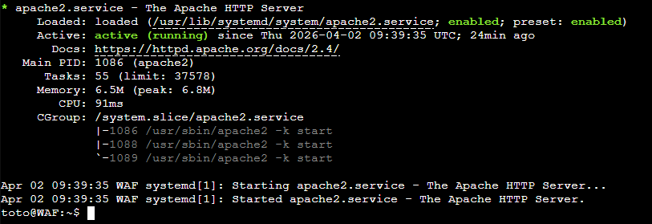


#### **1.3 Configuration du pare-feu avec UFW pour les services web**

La configuration d'un pare-feu au niveau de l'hôte est une étape de sécurité non négociable. **UFW (Uncomplicated Firewall)** fournit une interface conviviale pour gérer `iptables`.

  * **Lister les profils d'application disponibles**
    ```bash
    sudo ufw app list
    ```
  * **Autoriser le trafic web standard (`HTTP` & `HTTPS`)**
    ```bash
    sudo ufw allow 'Apache Full'
    sudo ufw allow 'OpenSSH'
    ```
  * **Activer le pare-feu**
    ```bash
    sudo ufw enable
    ```
  * **Vérifier l'état et les règles actives**
    ```bash
    sudo ufw status
    ```

Cette configuration garantit que seules les connexions **SSH** (port 22) et **web** (ports 80 et 443) sont autorisées.

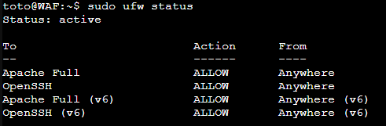

-----

### **2.0 Section 2 : Installation et configuration du moteur ModSecurity**

Cette section se concentre sur l'installation et la configuration du module **ModSecurity**, qui constitue le moteur d'inspection du WAF.

#### **2.1 Déploiement du module `libapache2-mod-security2`**

Installez le module depuis les dépôts officiels d'Ubuntu.

```bash
sudo apt install libapache2-mod-security2 -y
```

Le processus d'installation active généralement le module. Vérifiez et activez-le manuellement si nécessaire.

```bash
sudo a2enmod security2
```

Un redémarrage d'Apache est requis pour charger le nouveau module.

```bash
sudo systemctl restart apache2
```

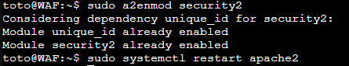


#### **2.2 Établissement de la configuration de base `modsecurity.conf`**

La meilleure pratique consiste à copier le fichier de configuration modèle pour créer la configuration active.

```bash
sudo cp /etc/modsecurity/modsecurity.conf-recommended /etc/modsecurity/modsecurity.conf
```

Le fichier `/etc/modsecurity/modsecurity.conf` devient le fichier de configuration principal du moteur ModSecurity.

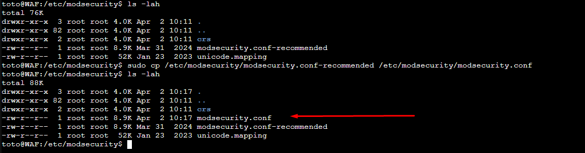

#### **2.3 Examen approfondi des directives essentielles**

Plusieurs directives dans `modsecurity.conf` sont d'une importance capitale :

  * **`SecRuleEngine`**: C'est l'interrupteur principal du WAF.

      * `On` : Les règles sont actives et bloquent les menaces.
      * `Off` : Le module est complètement désactivé.
      * `DetectionOnly` : Les règles journalisent les menaces mais ne bloquent rien.
        ⚠️ **Crucial** : Pour une nouvelle installation, commencez toujours en mode **`DetectionOnly`** pour identifier les faux positifs sans impacter les utilisateurs.

  * **`SecAuditEngine`**: Contrôle la journalisation d'audit. La valeur `On` est recommandée au début pour enregistrer toutes les transactions.

  * **`SecAuditLog`**: Définit le chemin du fichier journal d'audit, généralement `/var/log/apache2/modsec_audit.log`.

  * **`SecRequestBodyAccess On`**: Directive **critique**. Elle ordonne à ModSecurity d'inspecter le corps des requêtes (données de formulaire POST, JSON, etc.), où se trouvent la plupart des attaques applicatives.

  * **`SecRequestBodyLimit`**: Une mesure de défense contre les attaques par déni de service (**DoS**) qui limite la taille maximale du corps d'une requête.

-----

### **3.0 Section 3 : Intégration de l'OWASP Core Rule Set (CRS)**

Cette section détaille l'intégration de l'intelligence qui alimente le moteur ModSecurity.

#### **3.1 Le rôle du CRS en tant que couche d'intelligence du WAF**

ModSecurity est le **moteur**, mais le CRS est le **"cerveau"**. C'est cet ensemble de règles qui contient les signatures et les heuristiques pour détecter les attaques connues (injections SQL, XSS, etc.).

#### **3.2 Acquisition et structuration de la dernière version stable du CRS**

⚠️ **Important** : Le paysage des menaces évolue. Utilisez toujours la dernière version stable du CRS depuis le dépôt GitHub officiel `coreruleset`.

1.  **Télécharger la dernière version stable** (Vérifiez la version la plus récente sur la [page des publications du CRS](https://github.com/coreruleset/coreruleset/releases)).
    ```bash
    # Remplacez vX.Y.Z par la dernière version
    VERSION="v4.25.0" 
    cd /tmp
    wget "https://github.com/coreruleset/coreruleset/archive/refs/tags/${VERSION}.tar.gz"
    ```
2.  **Extraire et organiser les fichiers**
    ```bash
    tar -xzvf ${VERSION}.tar.gz
    sudo mv coreruleset-${VERSION/v/} /etc/apache2/modsecurity-crs
    ```

 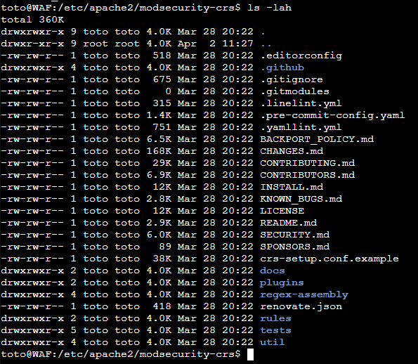   

#### **3.3 Configuration de `crs-setup.conf` : Niveaux de paranoïa**

Le CRS est livré avec un fichier de configuration modèle qui doit être activé et personnalisé.

```bash
cd /etc/apache2/modsecurity-crs
sudo cp crs-setup.conf.example crs-setup.conf
```

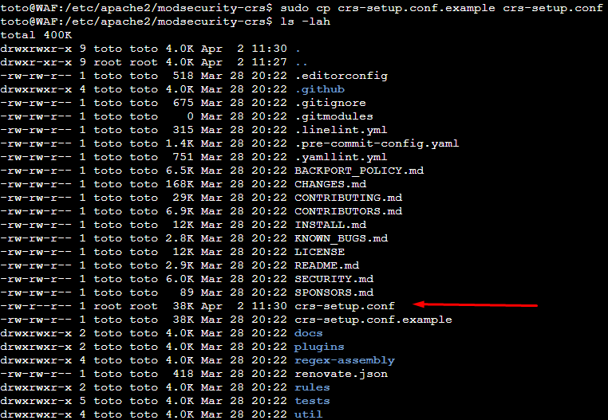

Le fichier `crs-setup.conf` permet de définir les **Niveaux de Paranoïa (Paranoia Levels - PL)**, qui offrent un compromis entre sécurité et risque de faux positifs.


| Niveau de Paranoïa | Description | Cas d'utilisation typique| Risque de faux positifs |
| ----------------- | -------------| ------------------------- | ---------------------- |
| **PL1 (Défaut)** | Protection de base contre les attaques les plus courantes.| Tous les sites web et API. **Le point de départ recommandé.** | Faible |
| **PL2** | Sécurité accrue contre des attaques plus avancées. | Sites e-commerce, applications avec données sensibles. | Moyen |
| **PL3** | Sécurité complète avec des règles plus restrictives.| Applications à haute sécurité (gouvernement, finance). | Élevé |
| **PL4** | Niveau paranoïaque. Extrêmement restrictif pour une sécurité maximale.| API ou segments d'application avec un trafic très prévisible. |Très élevé |


Pour commencer, il est recommandé de définir le niveau de paranoïa à **1** dans `nano /etc/apache2/modsecurity-crs/crs-setup.conf -c`

Cherchez la section suivante (autour de la ligne 100 selon la version), vérifier

```
SecDefaultAction "phase:1,log,auditlog,deny,status:403"
SecDefaultAction "phase:2,log,auditlog,deny,status:403"
```
Cherchez la section suivante (autour de la ligne 180 selon la version), vérifier

```
# Uncomment this rule to change the default:
#
SecAction \
    "id:900000,\
    phase:1,\
    pass,\
    t:none,\
    nolog,\
    tag:'OWASP_CRS',\
    ver:'OWASP_CRS/4.25.0',\
    setvar:tx.blocking_paranoia_level=1"
```

Cherchez la section suivante (à la fin), vérifier

```
# The variable is a numerical representation of the CRS version number.
# E.g., v3.0.0 is represented as 300.
#
SecAction \
    "id:900990,\ 
    phase:1,\
    pass,\ 
    t:none,\
    nolog,\
    tag:'OWASP_CRS',\
    ver:'OWASP_CRS/4.25.0',\
    setvar:tx.crs_setup_version=4180"
```

Différence avec SecDefaultAction

- SecDefaultAction : Définit l’action par défaut appliquée à chaque règle du CRS (ex. loguer, bloquer, laisser passer).
- phase:1 → analyse en début de requête
- log,auditlog → écrit dans les logs et l’audit log
- pass → ne bloque pas automatiquement à ce stade (c’est le mode Anomaly Scoring qui décide plus tard).
- SecAction setvar:tx.paranoia_level=1 : Définit le niveau de paranoïa (= quelles règles seront chargées).


#### **3.4 Activation du CRS dans la configuration d'Apache**

Indiquez à Apache de charger les fichiers du CRS. Ajoutez les lignes suivantes à la fin de `/etc/apache2/mods-enabled/security2.conf`.

```
<IfModule security2_module>
        # Default Debian dir for modsecurity's persistent data
        SecDataDir /var/cache/modsecurity


        # Inclure la configuration du CRS (DOIT ÊTRE EN PREMIER)
        IncludeOptional /etc/apache2/modsecurity-crs/crs-setup.conf
        # Inclure les fichiers de règles du CRS
        IncludeOptional /etc/apache2/modsecurity-crs/rules/*.conf

        # Include all the *.conf files in /etc/modsecurity.
        # Keeping your local configuration in that directory
        # will allow for an easy upgrade of THIS file and
        # make your life easier
        IncludeOptional /etc/modsecurity/*.conf

        # Include OWASP ModSecurity CRS rules if installed
#       IncludeOptional /usr/share/modsecurity-crs/*.load    #### COMMENTER
</IfModule>
```
-----
#### Désactiver la RULES bloqué l'accès via IP

Si vous faites un curl apprésent, le site ne sera pas accesible car nous n'avons pas de noms de domaine.

ModSecurity: Warning. Pattern match "(?:^([\\\\d.]+|\\\\[[\\\\da-f:]+\\\\]|[\\\\da-f:]+)(:[\\\\d]+)?$)" at REQUEST_HEADERS:Host. [file "/etc/apache2/modsecurity-crs/rules/REQUEST-920-PROTOCOL-ENFORCEMENT.conf"] [line "728"] [id "920350"] [msg "Host header is a numeric IP address"] [data "192.168.20.180"] [severity "WARNING"] 

#### Editer la Rules REQUEST-920-PROTOCOL-ENFORCEMENT.conf (vers la ligne 714) pour pass Host header is a numeric IP address

`nano /etc/apache2/modsecurity-crs/rules/REQUEST-920-PROTOCOL-ENFORCEMENT.conf -c`

```
SecRule REQUEST_HEADERS:Host "@rx (?:^([\d.]+|\[[\da-f:]+\]|[\da-f:]+)(:[\d]+)?$)" \
"id:920350,\
    phase:1,\
    pass,\  ### PASSER de block à pass
    t:none,\
    msg:'Host header is a numeric IP address',\
    logdata:'%{MATCHED_VAR}',\
    tag:'application-multi',\
    tag:'language-multi',\
    tag:'platform-multi',\
    tag:'attack-protocol',\
    tag:'paranoia-level/1',\
    tag:'OWASP_CRS',\
    tag:'OWASP_CRS/PROTOCOL-ENFORCEMENT',\
    tag:'capec/1000/210/272',\
    ver:'OWASP_CRS/4.25.0',\
    severity:'WARNING',\
    setvar:'tx.inbound_anomaly_score_pl1=+%{tx.warning_anomaly_score}'"
```

### **4.0 Section 4 : Vérification du système et simulation d'attaques**

Validez que la configuration est correcte et que le WAF fonctionne comme prévu.

#### **4.1 Vérification de la syntaxe et redémarrage**

Avant de redémarrer, vérifiez toujours la syntaxe de la configuration Apache pour éviter les pannes.

```bash
sudo apache2ctl configtest
```

Si la commande retourne `Syntax OK`, redémarrez le service.

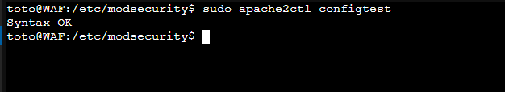

```bash
sudo systemctl restart apache2
```

#### **4.2 🧪 Simulation de vecteurs d'attaque avec `curl`**

Envoyez des requêtes malveillantes simples pour vérifier que le WAF les intercepte. Une réponse **`403 Forbidden`** est attendue.

  * **Test de Path Traversal**
    ```bash
    curl -i "http://<votre_ip_serveur>/?exec=/etc/passwd"
    ```
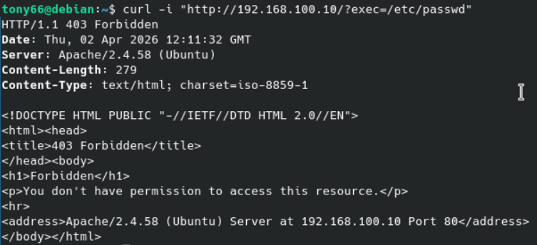

  * **Test de Cross-Site Scripting (XSS)**
    ```bash
    curl -i "http://<votre_ip_serveur>/?search=<script>alert('xss')</script>"
    ```
  * **Test d'injection SQL (SQLi)**
    ```bash
    curl -i "http://<votre_ip_serveur>/?id=1' OR 1=1--"
    ```

#### **4.3 Analyse des réponses `403 Forbidden`**

Recevoir un code `403 Forbidden` confirme que ModSecurity et l'OWASP CRS ont correctement identifié et bloqué la requête malveillante.

-----

### **5.0 Section 5 : Maîtrise de la journalisation et de l'analyse des alertes**

Un WAF qui bloque silencieusement est difficile à gérer. Comprendre ses journaux est une compétence essentielle.

#### **5.1 Navigation dans les journaux Apache et ModSecurity**

Deux fichiers journaux principaux sont à surveiller :

1.  **Journal d'erreurs d'Apache (`/var/log/apache2/error.log`)** : C'est le **signal**. Il vous alerte qu'un événement s'est produit avec un message concis et un ID de transaction unique.
    ```bash
    sudo tail -f /var/log/apache2/error.log
    ```
2.  **Journal d'audit de ModSecurity (`/var/log/apache2/modsec_audit.log`)** : C'est le **contexte**. Il contient les détails complets (forensiques) de chaque transaction.
    ```bash
    sudo tail -f /var/log/apache2/modsec_audit.log
    ```

💡 **Flux de travail** : Repérez l'alerte dans `error.log`, copiez l'ID unique, puis utilisez `grep` pour trouver l'entrée complète dans `modsec_audit.log` pour une analyse approfondie.

#### **5.2 Anatomie d'une entrée du journal `modsec_audit.log`**

Chaque entrée est composée de plusieurs sections identifiées par une lettre.

| Section | Nom                    | Description                                                                          |
| :------ | :--------------------- | :----------------------------------------------------------------------------------- |
| **A** | En-tête d'audit        | Métadonnées : Horodatage, ID unique, IP source/destination.                            |
| **B** | En-têtes de la requête | Liste complète des en-têtes HTTP envoyés par le client.                                |
| **C** | Corps de la requête    | La charge utile (ex: données POST). Crucial pour l'analyse.                            |
| **H** | Pied de page d'audit   | Informations récapitulatives, y compris les messages des règles déclenchées.         |
| **K** | Règles correspondantes | Liste consolidée de toutes les règles qui ont correspondu. Essentiel pour le diagnostic. |
| **Z** | Délimiteur final       | Marque la fin de l'entrée du journal.                                                  |

-----

# Configuration PHP / MariaDB sur la stack

### Étape 1 : Prérequis (Pile LAMP et ModSecurity)
Assurez-vous que votre serveur web Apache, PHP, MariaDB et le module ModSecurity sont installés.

```
sudo apt update
sudo apt install apache2 mariadb-server php php-mysqli libapache2-mod-security2 -y
```

### Étape 2 : Préparation de la Base de Données (MariaDB)
Nous allons créer une base de données, un utilisateur dédié et une table pour stocker les identifiants. Connectez-vous à MariaDB :

```
sudo mariadb
Exécutez ensuite les commandes SQL suivantes :

SQL
-- Création de la base de données
CREATE DATABASE lab_secu_db;

-- Création d'un utilisateur local avec des droits restreints à cette BDD
CREATE USER 'lab_user'@'localhost' IDENTIFIED BY 'SuperMotDePasse123!';
GRANT ALL PRIVILEGES ON lab_secu_db.* TO 'lab_user'@'localhost';
FLUSH PRIVILEGES;

-- Utilisation de la base et création de la table
USE lab_secu_db;
CREATE TABLE utilisateurs (
    id INT AUTO_INCREMENT PRIMARY KEY,
    username VARCHAR(50) NOT NULL,
    password VARCHAR(255) NOT NULL
);

-- Insertion d'un utilisateur légitime pour les tests
INSERT INTO utilisateurs (username, password) VALUES ('admin', 'password_secret');
exit;
```

### Étape 3 : Le Code PHP Vulnérable (Inscription et Connexion)
Créez un fichier nommé index.php dans le répertoire racine de votre serveur web (généralement /var/www/html/). Supprimez le fichier index.html par défaut s'il existe.

Ce script contient un formulaire pour enregistrer un utilisateur et un formulaire pour se connecter. Les deux sont intentionnellement vulnérables, car les entrées de l'utilisateur sont concaténées directement dans la requête SQL sans aucun nettoyage ni préparation.

`sudo nano /var/www/html/index.php`

```
<?php
$host = 'localhost';
$db   = 'lab_secu_db';
$user = 'lab_user';
$pass = 'SuperMotDePasse123!';

// Connexion à la base de données
$conn = new mysqli($host, $user, $pass, $db);
if ($conn->connect_error) {
    die("Erreur de connexion : " . $conn->connect_error);
}

echo "<h2>Laboratoire ModSecurity - Injections SQL</h2>";

// Traitement de l'inscription (Écriture en BDD)
if (isset($_POST['register'])) {
    $reg_user = $_POST['reg_username'];
    $reg_pass = $_POST['reg_password'];

    // VULNÉRABILITÉ : Concaténation directe dans l'INSERT
    $sql_insert = "INSERT INTO utilisateurs (username, password) VALUES ('$reg_user', '$reg_pass')";
    
    if ($conn->query($sql_insert) === TRUE) {
        echo "<p style='color:green;'>Nouvel utilisateur enregistré avec succès !</p>";
    } else {
        echo "<p style='color:red;'>Erreur : " . $conn->error . "</p>";
    }
}

// Traitement de la connexion (Lecture en BDD)
if (isset($_POST['login'])) {
    $log_user = $_POST['log_username'];
    $log_pass = $_POST['log_password'];

    // VULNÉRABILITÉ : Concaténation directe dans le SELECT
    $sql_select = "SELECT * FROM utilisateurs WHERE username = '$log_user' AND password = '$log_pass'";
    $result = $conn->query($sql_select);

    if ($result && $result->num_rows > 0) {
        echo "<p style='background-color:green; color:white; padding:10px;'>Connexion RÉUSSIE en tant que : " . htmlspecialchars($log_user) . "</p>";
    } else {
        echo "<p style='background-color:red; color:white; padding:10px;'>Échec de la connexion. Identifiants incorrects.</p>";
    }
}
?>

<hr>
<h3>1. Enregistrer un utilisateur</h3>
<form method="POST" action="">
    Utilisateur : <input type="text" name="reg_username"><br><br>
    Mot de passe : <input type="password" name="reg_password"><br><br>
    <input type="submit" name="register" value="S'inscrire">
</form>

<hr>
<h3>2. Se connecter</h3>
<form method="POST" action="">
    Utilisateur : <input type="text" name="log_username"><br><br>
    Mot de passe : <input type="password" name="log_password"><br><br>
    <input type="submit" name="login" value="Connexion">
</form>
```
### Étape 4 : Tester l'attaque (Sans ModSecurity actif)
Avant d'activer la protection ModSecurity, testez la vulnérabilité de votre formulaire de connexion.

Allez sur http://votre_ip_serveur/index.php.
Dans le formulaire 2. Se connecter, entrez la charge utile (payload) classique suivante dans le champ "Utilisateur" :

' OR '1'='1

Et mettez n'importe quoi dans le mot de passe.

:warning 
Explication : La requête SQL exécutée par le serveur deviendra :

SELECT * FROM utilisateurs WHERE username = '' OR '1'='1' AND password = '...'

Comme 1=1 est toujours vrai, la base de données renverra le premier utilisateur de la table (souvent l'administrateur), permettant de contourner l'authentification. Vous devriez voir le message vert de réussite.

### Dans l'URL du navigateur, tester l'injection SQL suivante: 

http://<votre_ip_serveur>/?id=1' OR 1=1--

## Attaque par l'UNION

Le concept de l'attaque UNION
L'opérateur SQL UNION permet de combiner les résultats de deux requêtes SELECT distinctes en un seul tableau de résultats.

Dans votre script, la requête d'origine est :
`SELECT * FROM utilisateurs WHERE username = '$log_user' AND password = '...'`

Le but de l'attaquant est d'injecter un second SELECT via le champ $log_user pour forcer la base de données à renvoyer des informations qu'elle ne devrait pas (comme des mots de passe ou la structure d'autres tables).

La règle d'or du UNION : Les deux requêtes doivent demander exactement le même nombre de colonnes. Votre table utilisateurs possède 3 colonnes (id, username, password). Notre requête injectée devra donc aussi demander 3 éléments.

L'attaque : Extraire le mot de passe de l'admin
Voici comment construire cette attaque étape par étape via curl.

L'idée est de faire échouer la première requête (en cherchant un utilisateur qui n'existe pas, comme "personne"), puis d'y attacher notre requête d'extraction avec UNION.

Voici la charge utile (payload) que nous allons injecter dans le champ log_username :
`' UNION SELECT 1, password, 3 FROM utilisateurs WHERE username='admin' #`

Pourquoi cette construction ?

`' `: Ferme la chaîne du nom d'utilisateur de la requête d'origine.

UNION SELECT 1, password, 3 : Nous demandons 3 colonnes pour correspondre à la table d'origine. Nous mettons le champ password dans la 2ème colonne.

`FROM utilisateurs WHERE username='admin'` : La cible de notre extraction.

Le # sert à Commenter le reste de la requête d'origine (le check du mot de passe).

### Exécution de l'attaque UNION avec curl
Exécutez cette commande dans votre terminal :

```
curl -s -X POST http://localhost/index.php \
     -d "log_username=personne' UNION SELECT 1, password, 3 FROM utilisateurs WHERE username='admin' #" \
     -d "log_password=nimportequoi" \
     -d "login=Connexion" | grep "Connexion RÉUSSIE"
```

### TEST avec SecRuleEngine:ON

- Test avec le formulaire :

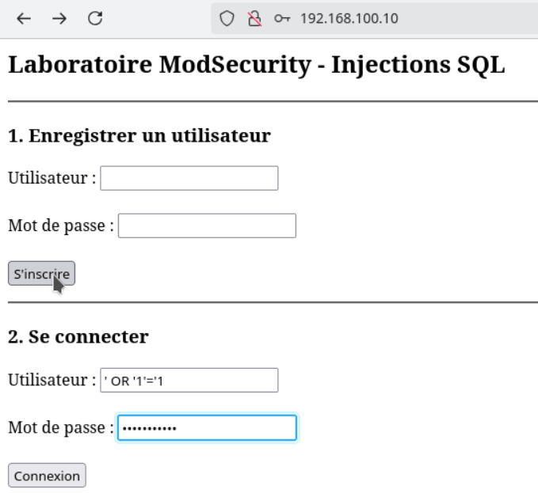 ; 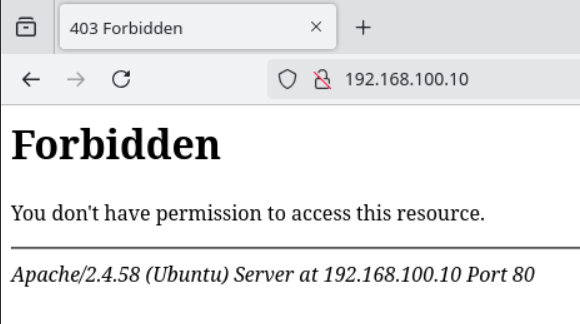

- Test avec l'url 

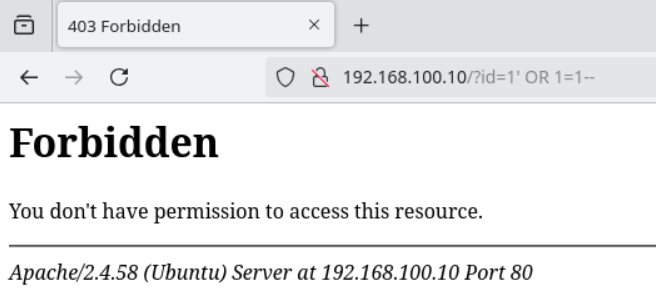


### TEST avec SecRuleEngine:DetectionOnly

- On active les logs coté serveur

```bash
 sudo tail -f /var/log/apache2/modsec_audit.log
 ```

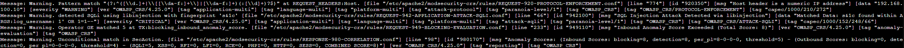


###  TEST Exécution de l'attaque UNION avec curl

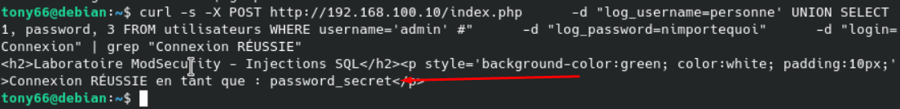

- Creation d'un User "test" depuis le formulaire , Recuperation du MDP avec le curl 

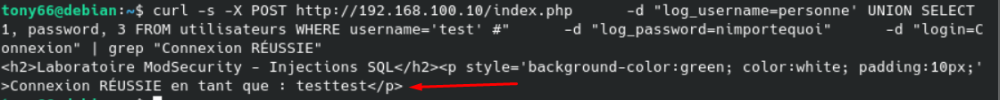