# Déployer une surveillance de sécurité avec Wazuh et détecter des incidents

## Objectif

 L’entreprise Let'sInnov poursuit la modernisation et la sécurisation de son infrastructure informatique. Après plusieurs alertes de sécurité liées à des connexions suspectes, des tentatives de brute force et des comportements anormaux observés sur certains serveurs, la direction souhaite améliorer ses capacités de supervision et de détection des incidents.

En tant qu’administrateur d’infrastructures sécurisées au sein de l’équipe SOC interne, vous êtes chargé de mettre en œuvre une solution centralisée de supervision de sécurité reposant sur un SIEM open-source. L’objectif est de collecter et corréler les journaux issus des équipements réseau, des serveurs Linux et Windows ainsi que des postes utilisateurs afin de détecter rapidement des comportements suspects.

Vous devrez installer et configurer Wazuh dans un environnement virtualisé, intégrer différentes sources de logs et mettre en œuvre plusieurs cas d’usage de détection. Vous serez également amené à déployer un IDS réseau, configurer des règles de surveillance et analyser les alertes générées lors de simulations d’attaques.

L’infrastructure devra permettre :

la collecte centralisée des journaux
la supervision des événements de sécurité
la détection d’activités malveillantes
l’analyse des alertes
la documentation des incidents détectés
l’amélioration continue des règles de détection
L’ensemble des opérations devra respecter les bonnes pratiques de cybersécurité et être documenté afin de permettre une exploitation par l’équipe informatique.


## Schéma de l’architecture de supervision


## Mission 1 : Installation et Configuration de Wazuh - Installer Wazuh dans un environnement simulé et configurer la collecte de logs

### Installation OS 

- J'ai installé **Ubuntu 24.04** avec GUI qui fait partie des OS recommandés avec une carte en bridge.  

- Je mets à jour la liste des paquets et je mets à jour ensuite le système

```bash
sudo apt update && sudo apt upgrade -y
```  

### Installation Wazuh

Installation de Wazuh avec curl (après instll de curl)  

```bash
curl -sO https://packages.wazuh.com/4.14/wazuh-install.sh && sudo bash ./wazuh-install.sh -a
```  

- A la fin de l'installation le username et un password fort sont générés automatiquement.  


- Je peux ensuite me connecter avec l'interface Web : **`Mon_ip`** et me connecter 


- Les user/password sont stockés dans un ficher compressé accessible avec 

```bash
sudo tar -O -xvf wazuh-install-files.tar wazuh-install-files/wazuh-passwords.txt
```

- Désactivation des mises à jour de Wazuh pour éviter les mises à jour accidentelles susceptibles de perturber l'environnement :  

```bash
sudo sed -i "s/^deb /#deb /" /etc/apt/sources.list.d/wazuh.list
sudo apt update
```


## Mission 2 : Explorer les capacités de Wazuh à travers les différents uses cases proposés dans sa documentation officielle (à travers la réalisation de use-cases pratiques)

### 1 - Intégration de l'IDS Suricata : https://documentation.wazuh.com/current/proof-of-concept-guide/integrate-network-ids-suricata.html

#### Installation NIDS Suricata

- J'ai décidé d'installer l'agent Suricata sur une VM cliente Debian 12.

```bash
# 1. Configurer les dépôts officiels Debian 12 + backports
cat > /etc/apt/sources.list <<'EOF'
deb http://deb.debian.org/debian bookworm main
deb http://deb.debian.org/debian-security bookworm-security main
deb http://deb.debian.org/debian bookworm-updates main
deb http://deb.debian.org/debian bookworm-backports main
EOF

# 2. Mettre à jour les dépôts
sudo apt update

# 3. Installer Suricata depuis les backports Debian
sudo apt install -t bookworm-backports -y suricata

# 4. Vérifier l'installation
suricata --build-info

# 5. Activer et démarrer le service
sudo systemctl enable --now suricata

# 6. Vérifier l'état du service
sudo systemctl status suricata
```
- Télécharger et extraire le jeu de règles Emerging Threats Suricata 

```bash
cd /tmp/ && curl -LO https://rules.emergingthreats.net/open/suricata-6.0.8/emerging.rules.tar.gz
sudo tar -xvzf emerging.rules.tar.gz && sudo mkdir /etc/suricata/rules && sudo mv rules/*.rules /etc/>suricata/rules/
sudo find /etc/suricata/rules -name "*.rules" -exec chmod 777 {} \;
```
- Modifier le fichier .yml dans /etc/suricata/suricata.yaml

```bash
HOME_NET: "<UBUNTU_IP>"
EXTERNAL_NET: "any"

default-rule-path: /etc/suricata/rules
rule-files:
- "*.rules"

# Global stats configuration
stats:
enabled: yes

# Linux high speed capture support
af-packet:
  - interface: "selon l'interface"
  ```

  Puis

  ```sudo systemctl restart suricata```

  #### Installation AGENT Wazuh sur Linux (Debian 12)

  ```bash
  # 1. Installer le paquets i il est manquant
  apt-get install gnupg apt-transport-https -y

  # 2. Insataller la clé GPG
  curl -s https://packages.wazuh.com/key/GPG-KEY-WAZUH | gpg --no-default-keyring --keyring gnupg-ring:/usr/share/keyrings/wazuh.gpg --import && chmod 644 /usr/share/keyrings/wazuh.gpg

  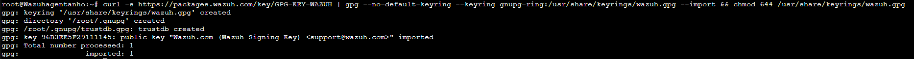

  # 3.Ajouter au Repo
  echo "deb [signed-by=/usr/share/keyrings/wazuh.gpg] https://packages.wazuh.com/4.x/apt/ stable main" | tee -a /etc/apt/sources.list.d/wazuh.list
  
  # 4. Update le paquet
  apt-get update
  ```
  #### Deployer AGENT Wazuh sur Linux (Debian 12)

  ```bash
  WAZUH_MANAGER="IP_Serveur_Wazuh" apt-get install wazuh-agent
  ```

 
 - Redemarrer les Services

 ```bash
systemctl daemon-reload
systemctl enable wazuh-agent
systemctl start wazuh-agent
```

#### Ajouter la config dans /var/ossec/etc/ossec.conf il permet a l'agent de lire les logs de suricata

```bash
<ossec_config>
  <localfile>
    <log_format>json</log_format>
    <location>/var/log/suricata/eve.json</location>
  </localfile>
</ossec_config>
```
Puis

```
sudo systemctl restart wazuh-agent
```

#### Test D'attaque 

Depuis la machine Wazuh serveur faire un 

```bash
ping -c 20 "IP_agent"
```
Puis aller sur L'interface GUI de Wazuh dans Threat intelligence ->Treat Hunting -> et en haut a gauche Events
Dans la barre search mettre " rule.groups:suricata"

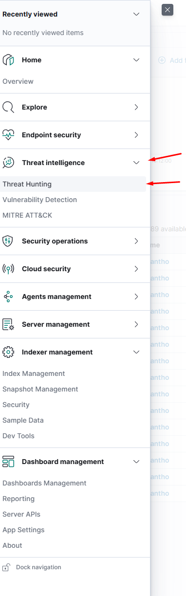


### 2 - Surveillance de l'intégrité de répertoires/fichiers sensibles : https://documentation.wazuh.com/current/proof-of-concept-guide/poc-file-integrity-monitoring.html

- Ajouter cette ligne dans /var/ossec/etc/ossec.conf , Dans le block syscheck 

```bash
<directories check_all="yes" report_changes="yes" realtime="yes">/root</directories>
```
Puis 

```
sudo systemctl restart wazuh-agent

```
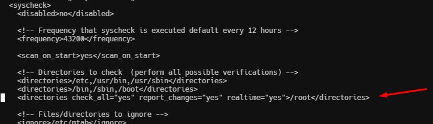

Creer un fichier a la racine ou dans le documents choisi auparavent puis ecrire dessus et le supprimer, ensuite aller verifier dans Wazuh .

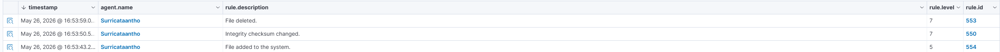


### 3 - Détection d'attaques bruteforce : https://documentation.wazuh.com/current/proof-of-concept-guide/detect-brute-force-attack.html

#### Installer Hydra sur une machine attaquante

```bash
sudo apt update
sudo apt install -y hydra
```

- Creer une liste avec 10 mot de passe aleatoire 

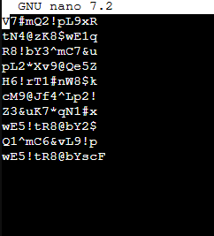

#### Test d'attaque
 
```bash
sudo hydra -l nom_user -P <PASSWD_LIST.txt> <IP_cible> ssh
```

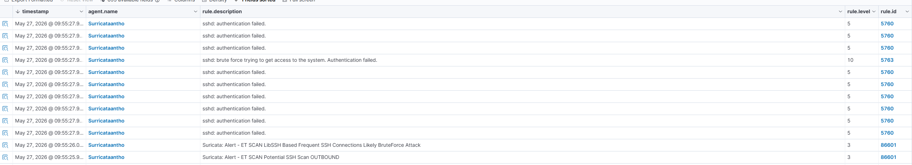

- Pour m'amuser j'ai mis le vrai mot de passe dans ma liste afin de voir le retour sur Wazuh.

Il detecte bien que il y a eu plusieurs echec suivi d'un succes 

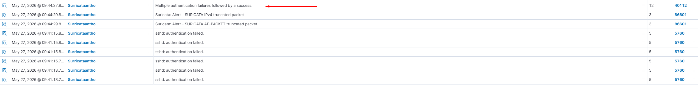

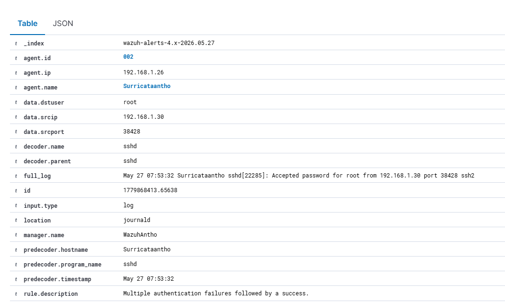

### 4 - Détection de processus non autorisés : https://documentation.wazuh.com/current/proof-of-concept-guide/detect-unauthorized-processes-netcat.html

#### Ajouter la config sur l'agent dans /var/ossec/etc/ossec.conf 

```bash
<ossec_config>
  <localfile>
    <log_format>full_command</log_format>
    <alias>process list</alias>
    <command>ps -e -o pid,uname,command</command>
    <frequency>30</frequency>
  </localfile>
</ossec_config>
```
- Redemarrer l'agent

```
sudo systemctl restart wazuh-agent
```
#### Installer Netcat sur l'agent

```bash
sudo apt install ncat nmap -y
```
#### Ajouter la config sur Wazuh Serveur dans /var/ossec/etc/rules/local_rules.xml

```bash
<group name="ossec,">
  <rule id="100050" level="0">
    <if_sid>530</if_sid>
    <match>^ossec: output: 'process list'</match>
    <description>List of running processes.</description>
    <group>process_monitor,</group>
  </rule>

  <rule id="100051" level="7" ignore="900">
    <if_sid>100050</if_sid>
    <match>nc -l</match>
    <description>netcat listening for incoming connections.</description>
    <group>process_monitor,</group>
  </rule>
</group>
```
- Redemarrer Wazuh manager

```
sudo systemctl restart wazuh-manager
```

#### Test d'attaque

- Lancer la commande depuis l'agent pendant 30 sec

```bash
nc -l 8000
```

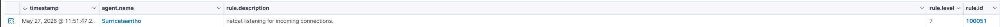

### 5 - Détection de tentatives d'injection SQL : https://documentation.wazuh.com/current/proof-of-concept-guide/detect-web-attack-sql-injection.html

#### Installer Apache sur le client 

```bash
sudo apt update
sudo apt install apache2
```
- Si le firewall est activé , modifier pour autoriser l'accès externe au ports Web.Ignorez cette étape si le pare-feu est désactivé.

```bash
sudo ufw app list
sudo ufw allow 'Apache'
sudo ufw status
```
- Vérifiez l'état du service Apache pour vérifier que le serveur Web est en cours d'exécution

```
sudo systemctl status apache2
```

- Utiliser curl pour verifier si la page apache est ok 

```
curl http://<IP_Machine>
```
#### Ajouter les lignes sur l'agent dans /var/ossec/etc/ossec.conf. Cela permet à l'agent Wazuh de surveiller les journaux d'accès de votre serveur Apache.

```bash
<ossec_config>
  <localfile>
    <log_format>apache</log_format>
    <location>/var/log/apache2/access.log</location>
  </localfile>
</ossec_config>
```

- Redemarrer l'agent 

```
sudo systemctl restart wazuh-agent
```

#### Test D'attaque depuis la machine attaquante
 
 ```bash
 curl -XGET "http://<IP_Machine>/users/?id=SELECT+*+FROM+users";
```

- Le résultat attendu ici est une alerte avec l'ID de règle 31103, mais une tentative d'injection SQL réussie génère une alerte avec l'ID de règle 31106

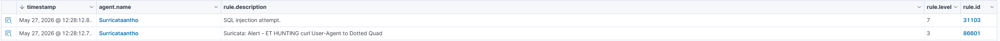

### 6 - Détection de cheval de troie : https://documentation.wazuh.com/current/proof-of-concept-guide/poc-detect-trojan.html

 #### Ajouter les lignes sur l'agent dans /var/ossec/etc/ossec.conf. Cela permet à l'agent Wazuh de vérifier la racine Wazuh et effectuer la détection des anomalies et des logiciels malveillants.

 *Par défaut, le module Wazuh rootcheck est activé dans le fichier de configuration de l'agent Wazuh. Vérifiez le <rootcheck> bloc dans le /var/ossec/etc/ossec.conf fichier de configuration du point de terminaison surveillé et assurez-vous qu'il a la configuration ci-dessous*

 ```bash
 <rootcheck>
    <disabled>no</disabled>
    <check_files>yes</check_files>

    <!-- Line for trojans detection -->
    <check_trojans>yes</check_trojans>

    <check_dev>yes</check_dev>
    <check_sys>yes</check_sys>
    <check_pids>yes</check_pids>
    <check_ports>yes</check_ports>
    <check_if>yes</check_if>

    <!-- Frequency that rootcheck is executed - every 12 hours -->
    <frequency>43200</frequency>
    <rootkit_files>/var/ossec/etc/shared/rootkit_files.txt</rootkit_files>
    <rootkit_trojans>/var/ossec/etc/shared/rootkit_trojans.txt</rootkit_trojans>
    <skip_nfs>yes</skip_nfs>
</rootcheck>
```
#### Test D'attaque 

- Sur la Machine Agent, Créez une copie du binaire système d'origine.

```bash
sudo cp -p /usr/bin/w /usr/bin/w.copy
```
- Remplacer le binaire du système d'origine /usr/bin/w avec le script shell suivant 


```bash
sudo tee /usr/bin/w << EOF
!/bin/bash
echo "`date` this is evil" > /tmp/trojan_created_file
echo 'test for /usr/bin/w trojaned file' >> /tmp/trojan_created_file
Now running original binary
/usr/bin/w.copy
EOF
```
- Redemarrer l'agent


```bash
sudo systemctl restart wazuh-agent
```
#### Visualiser les Alertes dans Wazuh

- Pour une recherche plus rapide mettre ce filtre dans la barre de recherche.Sinon chercher l'id 510

 *location:rootcheck AND rule.id:510 AND data.title:Trojaned version of file detected*


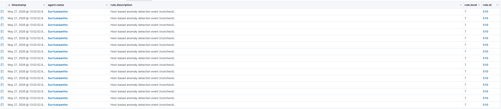

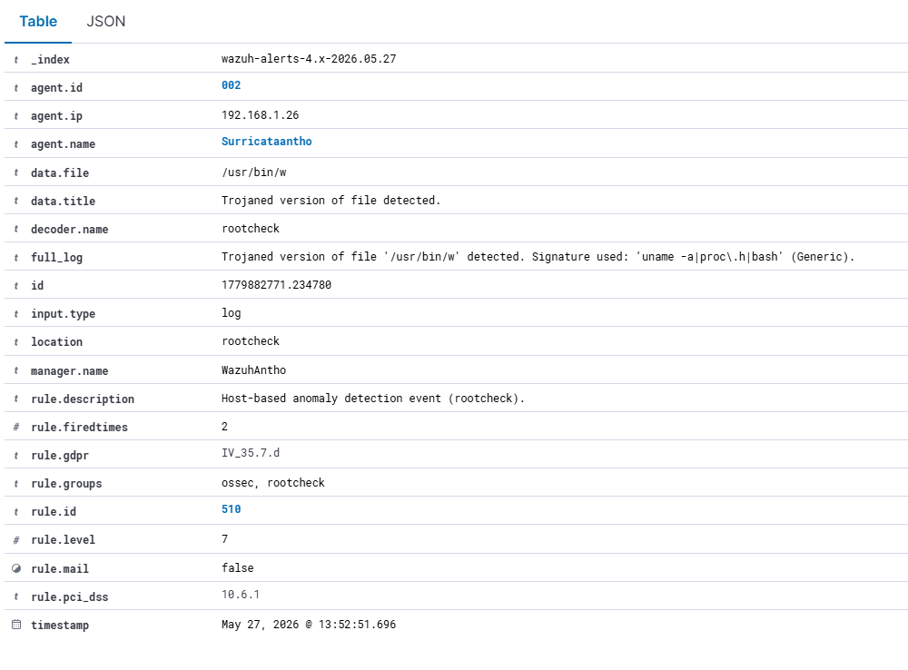

### 7 - Traitement de malware à travers l'intégration de VirusTotal : https://documentation.wazuh.com/current/proof-of-concept-guide/detect-remove-malware-virustotal.html

- SUR L'AGENT

#### Rechercher le **syscheck** bloc dans le fichier de configuration de l'agent Wazuh /var/ossec/etc/ossec.conf. Assurez-vous que **disabled** est réglé sur **no**. Cela permet au Wazuh FIM de surveiller les modifications de répertoire.

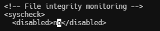

#### Ajouter une entrée dans le **syscheck** bloc pour configurer un répertoire à surveiller en temps quasi réel. Dans ce cas, vous surveillez le /root répertoire

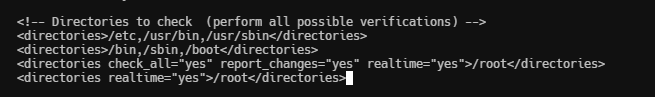

#### Installer **jq**, un utilitaire qui traite les entrées JSON du script de réponse actif.

```bash
sudo apt update
sudo apt -y install jq
```
#### Créer le /var/ossec/active-response/bin/remove-threat.sh script de réponse actif pour supprimer les fichiers malveillants du point de terminaison 

```bash
#!/bin/bash

LOCAL=`dirname $0`;
cd $LOCAL
cd ../

PWD=`pwd`

read INPUT_JSON
FILENAME=$(echo $INPUT_JSON | jq -r .parameters.alert.data.virustotal.source.file)
COMMAND=$(echo $INPUT_JSON | jq -r .command)
LOG_FILE="${PWD}/../logs/active-responses.log"

#------------------------ Analyze command -------------------------#
if [ ${COMMAND} = "add" ]
then
 # Send control message to execd
 printf '{"version":1,"origin":{"name":"remove-threat","module":"active-response"},"command":"check_keys", "parameters":{"keys":[]}}\n'

 read RESPONSE
 COMMAND2=$(echo $RESPONSE | jq -r .command)
 if [ ${COMMAND2} != "continue" ]
 then
  echo "`date '+%Y/%m/%d %H:%M:%S'` $0: $INPUT_JSON Remove threat active response aborted" >> ${LOG_FILE}
  exit 0;
 fi
fi

# Removing file
rm -f $FILENAME
if [ $? -eq 0 ]; then
 echo "`date '+%Y/%m/%d %H:%M:%S'` $0: $INPUT_JSON Successfully removed threat" >> ${LOG_FILE}
else
 echo "`date '+%Y/%m/%d %H:%M:%S'` $0: $INPUT_JSON Error removing threat" >> ${LOG_FILE}
fi

exit 0;

```
- Donner les droits au script

```bash
sudo chmod 750 /var/ossec/active-response/bin/remove-threat.sh
sudo chown root:wazuh /var/ossec/active-response/bin/remove-threat.sh
```
- Redemarrer l'agent

```bash
sudo systemctl restart wazuh-agent
```
- SUR LE SERVEUR WAZUH

*Effectuez les étapes suivantes sur le serveur Wazuh pour alerter des modifications dans le répertoire des points de terminaison et activer l’intégration VirusTotal. Ces étapes activent et déclenchent également le script de réponse actif chaque fois qu’un fichier suspect est détecté.*

#### Ajoutez les règles suivantes au /var/ossec/etc/rules/local_rules.xml fichier sur le serveur Wazuh. Ces règles alertent sur les changements dans le /root répertoire détecté par les analyses FIM.

```bash
<group name="syscheck,pci_dss_11.5,nist_800_53_SI.7,">
    <!-- Rules for Linux systems -->
    <rule id="100200" level="7">
        <if_sid>550</if_sid>
        <field name="file">/root</field>
        <description>File modified in /root directory.</description>
    </rule>
    <rule id="100201" level="7">
        <if_sid>554</if_sid>
        <field name="file">/root</field>
        <description>File added to /root directory.</description>
    </rule>
</group>
```
#### Ajoutez la configuration suivante au serveur Wazuh /var/ossec/etc/ossec.conf fichier pour activer l'intégration Virustotal. Remplacer <YOUR_VIRUS_TOTAL_API_KEY> avec ton Clé API VirusTotal. Cela permet de déclencher une requête VirusTotal chaque fois que l'une des règles 100200 et 100201 sont déclenchés

```bash
<ossec_config>
  <integration>
    <name>virustotal</name>
    <api_key><YOUR_VIRUS_TOTAL_API_KEY></api_key> <!-- Replace with your VirusTotal API key -->
    <rule_id>100200,100201</rule_id>
    <alert_format>json</alert_format>
  </integration>
</ossec_config>
```
#### Ajoutez les blocs suivants au serveur Wazuh /var/ossec/etc/ossec.conf déposer. Cela permet une réponse active et déclenche le remove-threat.sh script lorsque VirusTotal signale un fichier comme malveillant.

```bash
<ossec_config>
  <command>
    <name>remove-threat</name>
    <executable>remove-threat.sh</executable>
    <timeout_allowed>no</timeout_allowed>
  </command>

  <active-response>
    <disabled>no</disabled>
    <command>remove-threat</command>
    <location>local</location>
    <rules_id>87105</rules_id>
  </active-response>
</ossec_config>
```
#### Ajoutez les règles suivantes au serveur Wazuh /var/ossec/etc/rules/local_rules.xml fichier pour alerter sur les résultats de la réponse active

```bash
<group name="virustotal,">
  <rule id="100092" level="12">
    <if_sid>657</if_sid>
    <match>Successfully removed threat</match>
    <description>$(parameters.program) removed threat located at $(parameters.alert.data.virustotal.source.file)</description>
  </rule>

  <rule id="100093" level="12">
    <if_sid>657</if_sid>
    <match>Error removing threat</match>
    <description>Error removing threat located at $(parameters.alert.data.virustotal.source.file)</description>
  </rule>
</group>
```
- Redemarrer Wazuh manager
```
sudo systemctl restart wazuh-manager
```
#### Test D'attaque 

- Téléchargez un fichier de test EICAR sur le /root répertoire sur l'agent

```bash
sudo curl -Lo /root/eicar.com https://secure.eicar.org/eicar.com && sudo ls -lah /root/eicar.com
```


- On vois bien que le fichier et maintenant supprimer aussi 


### 8 - Détection de vulnérabilités : https://documentation.wazuh.com/current/proof-of-concept-guide/poc-vulnerability-detection.html

*Le module de détection de vulnérabilité Wazuh est activé par défaut et génère des alertes lorsque de nouvelles vulnérabilités sont détectées ou lorsque des vulnérabilités existantes sont résolues via des mises à jour de packages, des suppressions ou des mises à niveau du système.*

- SUR SERVEUR WAZUH

#### Ouvrez la configuration Wazuh /var/ossec/etc/ossec.conf et vérifiez les paramètres suivants

```bash
<vulnerability-detection>
   <enabled>yes</enabled>
   <index-status>yes</index-status>
   <feed-update-interval>60m</feed-update-interval>
</vulnerability-detection>
```
#### La connexion de l'indexeur Wazuh est correctement configurée.

Par défaut, les paramètres de l'indexeur ont un hôte configuré. Il est réglé sur 0.0.0.0 comme souligné ci-dessous

```bash
<indexer>
  <enabled>yes</enabled>
  <hosts>
    <host>https://0.0.0.0:9200</host>
  </hosts>
  <ssl>
    <certificate_authorities>
      <ca>/etc/filebeat/certs/root-ca.pem</ca>
    </certificate_authorities>
    <certificate>/etc/filebeat/certs/filebeat.pem</certificate>
    <key>/etc/filebeat/certs/filebeat-key.pem</key>
  </ssl>
</indexer>
```
- Remplacer 0.0.0.0 avec l'adresse IP ou le nom d'hôte de votre nœud indexeur Wazuh. Vous pouvez trouver cette valeur dans le fichier de configuration Filebeat /etc/filebeat/filebeat.yml.

- Assurez-vous que le certificat Filebeat et le nom de la clé correspondent aux fichiers de certificat /etc/filebeat/certs.

- Si vous exécutez une infrastructure de cluster d'indexeurs Wazuh, ajoutez un *host* entrée pour chacun de vos nœuds. Par exemple, dans une configuration à deux nœuds :

```bash
<hosts>
  <host>https://10.0.0.1:9200</host>
  <host>https://10.0.0.2:9200</host>
</hosts>
```
- Redémarrez le gestionnaire Wazuh si vous avez apporté des modifications à la configuration 

```
sudo systemctl restart wazuh-manager
```

#### Visualiser les vulnerabilites

- Avant

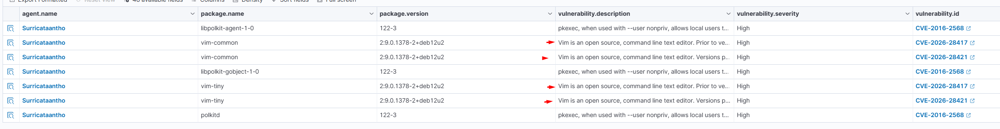

- Apres Suppression de vim 

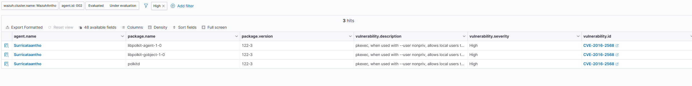

### 9 - Détection de processus cachés par rootkit : https://documentation.wazuh.com/current/proof-of-concept-guide/poc-detect-hidden-process.html

#### Passez à l'utilisateur root et mettez à jour le noyau de ce point de terminaison 

```bash
sudo su
apt update
```
#### Installez les packages requis pour créer le rootkit

```bash
apt -y install gcc git
```
#### Ensuite, configurez l’agent Wazuh pour exécuter des analyses rootcheck toutes les 2 minutes. Dans le /var/ossec/etc/ossec.conf déposer. Réglez le frequency option dans le *rootcheck* section à 120.

```bash
<rootcheck>
  <disabled>no</disabled>
  <check_files>yes</check_files>
  <check_trojans>yes</check_trojans>
  <check_dev>yes</check_dev>
  <check_sys>yes</check_sys>
  <check_pids>yes</check_pids>
  <check_ports>yes</check_ports>
  <check_if>yes</check_if>

  <!-- rootcheck execution frequency - every 12 hours by default-->

  <frequency>120</frequency>

  <rootkit_files>etc/shared/rootkit_files.txt</rootkit_files>
  <rootkit_trojans>etc/shared/rootkit_trojans.txt</rootkit_trojans>
  <skip_nfs>yes</skip_nfs>
</rootcheck>
```
- Redemarrer l'agent 

```bash
systemctl restart wazuh-agent
```
#### Test D'attaque 

- SUR L'AGENT

#### Récupérez le code source du rootkit Diamorphine depuis GitHub

```bash
git clone https://github.com/m0nad/Diamorphine
```
#### Accédez au répertoire Diamorphine et compilez le code source 

```bash
cd Diamorphine
make
```
#### Chargez le module du noyau rootkit

```bash
insmod diamorphine.ko
```
Le rootkit au niveau du noyau “Diamorphine” est désormais installé sur le point de terminaison Ubuntu.

📌 **Note importante**

> Selon l'environnement, le module ne parvient parfois pas à se charger ou à fonctionner correctement. Si vous recevez l'erreur dans la dernière étape, vous pouvez redémarrer le point de terminaison Linux et réessayer. Parfois, il faut plusieurs essais pour que cela fonctionne.insmod: ERROR: could not insert module diamorphine.ko: Invalid parameters

#### Exécutez kiil 63 avec le PID d'un processus aléatoire exécuté sur le point de terminaison de la machine . Cela dévoile le rootkit Diamorphine. Par défaut, Diamorphine se cache donc on ne le détecte pas en exécutant le lsmod commande. Essayez-le 

```bash
lsmod | grep diamorphine
kill -63 509
lsmod | grep diamorphine
```

<details open>
<summary>Output</summary>

diamorphine        13155    0

</details>

 *Lorsque vous utilisez ces dernières commandes, vous pouvez vous attendre à une sortie vide. Dans le cas de la Diamorphine, tout signal de mort 63 envoyé à n'importe quel processus, qu'il existe ou non, bascule le module du noyau Diamorphine pour masquer ou afficher.*


 #### Exécutez les commandes suivantes pour voir comment le rsyslogd le processus est d’abord visible puis n’est plus visible. Ce rootkit vous permet de masquer les processus sélectionnés du ps commande. Envoi d'un signal de mise à mort 31 masque/démasque tout processus.

 ```bash
 ps auxw | grep rsyslogd | grep -v grep
 ```
<details open>
<summary>Output</summary>


</details>

```bash
kill -31 <PID_OF_RSYSLOGD>
ps auxw | grep rsyslog | grep -v grep
```


*- Lorsque vous utilisez cette dernière commande, vous pouvez vous attendre à une sortie vide.*

*- Le prochain rootcheck scan s'exécutera et nous alertera du processus rsyslogd qui était caché avec le rootkit Diamorphine*

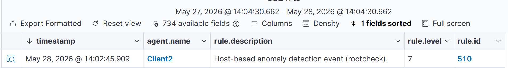


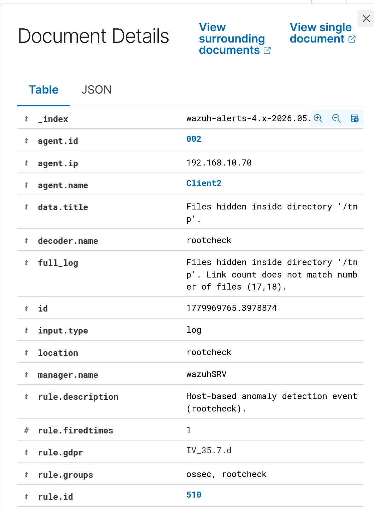

### 10 - Détection de commandes malveillantes : https://documentation.wazuh.com/current/proof-of-concept-guide/audit-commands-run-by-user.html

### Installer Auditd et créer les règles d’audit nécessaires pour interroger toutes les commandes exécutées par un utilisateur privilégié.

> - *SUR L'AGENT*

- Installez, démarrez et activez Auditd

```bash
sudo apt -y install auditd
sudo systemctl start auditd
sudo systemctl enable auditd
```

- En tant qu'utilisateur root, exécutez les commandes suivantes pour ajouter des règles d'audit /etc/audit/audit.rules fichier

```bash
echo "-a exit,always -F auid=1000 -F egid!=994 -F auid!=-1 -F arch=b32 -S execve -k audit-wazuh-c" >> /etc/audit/audit.rules
echo "-a exit,always -F auid=1000 -F egid!=994 -F auid!=-1 -F arch=b64 -S execve -k audit-wazuh-c" >> /etc/audit/audit.rules
```

- Recharger les règles et confirmer qu'elles sont en place

<details open>
<summary>Output</summary>

-a always,exit -F arch=b32 -S execve -F auid=1000 -F egid!=994 -F auid!=-1 -F key=audit-wazuh-c

-a always,exit -F arch=b64 -S execve -F auid=1000 -F egid!=994 -F auid!=-1 -F key=audit-wazuh-c

</details>

- Ajoutez la configuration suivante à l'agent Wazuh /var/ossec/etc/ossec.conf déposer. Cela permet à l'agent Wazuh de lire le fichier journaux auditd

```bash
<localfile>
  <log_format>audit</log_format>
  <location>/var/log/audit/audit.log</location>
</localfile>
```

- Redemarrer l'agent

```bash
sudo systemctl restart wazuh-agent
```

> - *SUR LE SERVEUR WAZUH*

#### Consultez les paires clé-valeur dans le fichier de recherche /var/ossec/etc/lists/audit-keys

```
audit-wazuh-w:write
audit-wazuh-r:read
audit-wazuh-a:attribute
audit-wazuh-x:execute
audit-wazuh-c:command
```

📌 **Note importante**

> Wazuh vous permet de maintenir des listes CDB de fichiers plats qui doivent être key seulement ou key:value paires. Ceux-ci sont compilés dans un format binaire spécial pour faciliter les recherches hautes performances dans les règles Wazuh. Ces listes doivent être créées sous forme de fichiers, ajoutées à la configuration Wazuh, puis compilées. Après cela, des règles peuvent être créées pour rechercher les champs décodés dans ces listes CDB dans le cadre de leurs critères de correspondance. Par exemple, en plus du fichier texte /var/ossec/etc/lists/audit-keys, il existe également un binaire /var/ossec/etc/lists/audit-keys.cdb fichier que Wazuh utilise pour des recherches réelles.

#### Créer une liste CDB /var/ossec/etc/lists/suspicious-programs et remplissez son contenu avec ce qui suit

```bash
ncat:yellow
nc:red
tcpdump:orange
```

#### Ajouter la liste au <ruleset> section du serveur Wazuh /var/ossec/etc/ossec.conf fichier

```bash
<list>etc/lists/suspicious-programs</list>
```

#### Créez une règle de gravité élevée à déclencher lorsqu'un programme « rouge » est exécuté. Ajoutez cette nouvelle règle à la /var/ossec/etc/rules/local_rules.xml fichier sur le serveur Wazuh

```bash
<group name="audit">
  <rule id="100210" level="12">
      <if_sid>80792</if_sid>
  <list field="audit.command" lookup="match_key_value" check_value="red">etc/lists/suspicious-programs</list>
    <description>Audit: Highly Suspicious Command executed: $(audit.exe)</description>
      <group>audit_command,</group>
  </rule>
</group>
```
- Redemarrer Wazuh

```bash
sudo systemctl restart wazuh-manager
```

#### Test D'attaque
 
 - Sur la machine agent installez et exécutez un "rouge" programme netcat

 ```bash
 sudo apt -y install netcat
 nc -v
 ```

 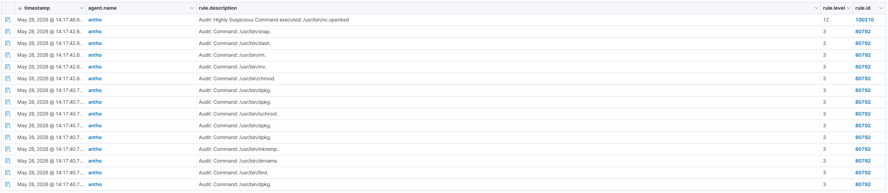

 ### Détection d'attaques shellshock : https://documentation.wazuh.com/current/proof-of-concept-guide/detect-web-attack-shellshock.html

 #### Si cela n'est pas deja fait , Installer Apache2, regarder le firewall si il est active ou pas , et regarder le status de Apache

 ```bash
sudo apt update
sudo apt install apache2
sudo ufw app list
sudo ufw allow 'Apache'
sudo ufw status
sudo systemctl status apache2
```
#### Ajoutez les lignes suivantes à l'agent Wazuh /var/ossec/etc/ossec.conf fichier de configuration. Cela définit l'agent Wazuh pour surveiller les journaux d'accès de votre serveur Apache

```bash
<localfile>
    <log_format>syslog</log_format>
    <location>/var/log/apache2/access.log</location>
</localfile>
```
- Redemarrer l'agent

```bash
sudo systemctl restart wazuh-agent
```

#### Test D'attaque

> - *Depuis la machine attaquante*

```bash
sudo curl -H "User-Agent: () { :; }; /bin/cat /etc/passwd" <WEBSERVER_IP_ADDRESS>
```

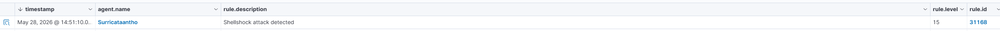

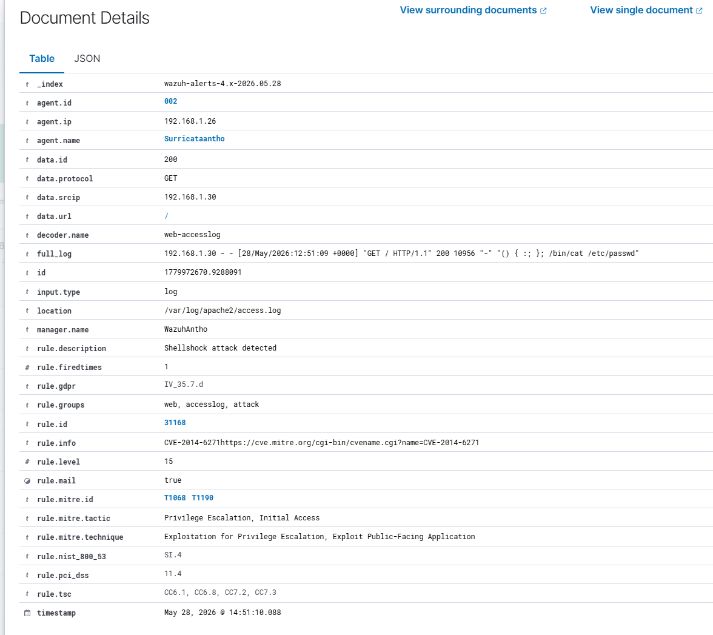
